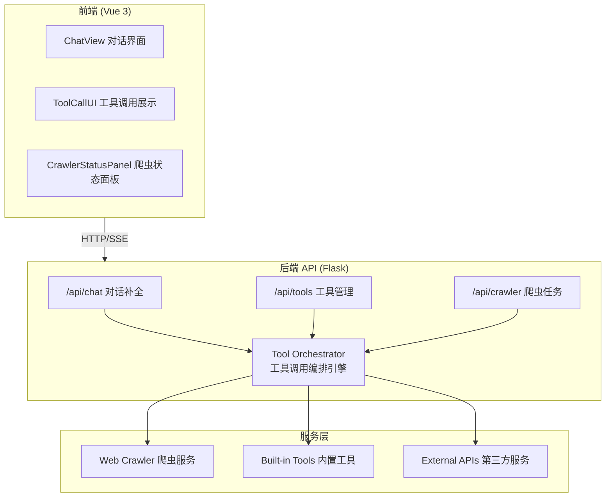
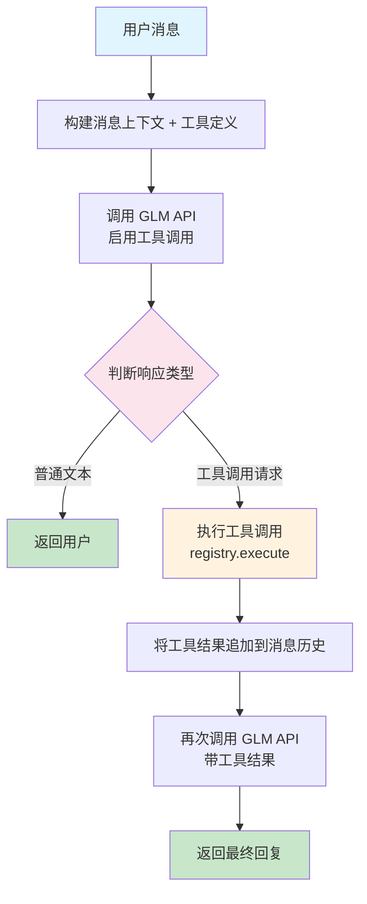
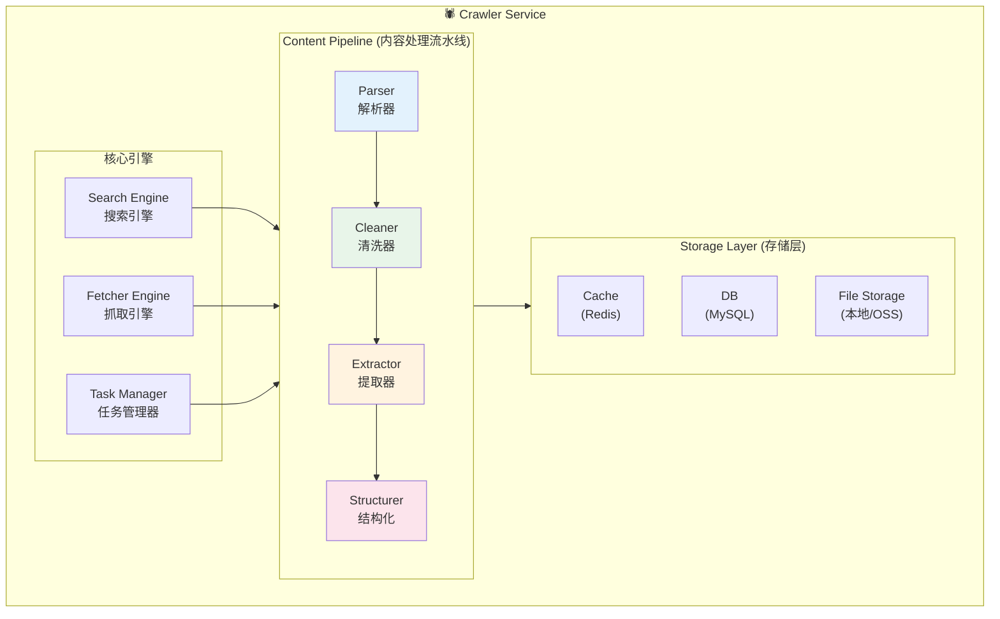

# 爬虫流水线与工具系统设计

## 概述

本文档描述如何为 NanoClaw 构建爬虫流水线和工具系统，使 GLM 模型能够：

1. 通过工具调用获取实时网络信息
2. 执行结构化的数据采集任务
3. 与外部系统进行交互

---

## 一、整体架构



---

## 二、工具系统设计

### 2.1 工具定义规范

工具采用 JSON Schema 定义，与 OpenAI Function Calling 兼容：

```python
# backend/tools/registry.py

from dataclasses import dataclass
from typing import Callable, Any
import json

@dataclass
class ToolDefinition:
    """工具定义"""
    name: str                    # 工具名称，如 "web_search"
    description: str             # 工具描述，供模型理解用途
    parameters: dict             # JSON Schema 格式的参数定义
    handler: Callable            # 实际执行函数

    def to_openai_format(self) -> dict:
        """转换为 GLM/OpenAI 兼容格式"""
        return {
            "type": "function",
            "function": {
                "name": self.name,
                "description": self.description,
                "parameters": self.parameters
            }
        }


# 工具注册表
class ToolRegistry:
    def __init__(self):
        self._tools: dict[str, ToolDefinition] = {}

    def register(self, tool: ToolDefinition):
        self._tools[tool.name] = tool

    def get(self, name: str) -> ToolDefinition | None:
        return self._tools.get(name)

    def list_all(self) -> list[dict]:
        return [t.to_openai_format() for t in self._tools.values()]

    def execute(self, name: str, arguments: dict) -> Any:
        tool = self.get(name)
        if not tool:
            raise ValueError(f"Tool not found: {name}")
        return tool.handler(**arguments)


# 全局注册表
registry = ToolRegistry()
```

### 2.2 内置工具定义

#### 2.2.1 网页搜索工具

```python
# backend/tools/builtin/web_search.py

from ..registry import registry, ToolDefinition

def web_search(query: str, max_results: int = 5) -> dict:
    """
    执行网页搜索

    Args:
        query: 搜索关键词
        max_results: 最大返回结果数

    Returns:
        搜索结果列表
    """
    # 调用爬虫服务执行搜索
    from ..crawler import search_service
    results = search_service.search(query, max_results)
    return {
        "success": True,
        "results": results
    }

# 注册工具
registry.register(ToolDefinition(
    name="web_search",
    description="搜索互联网获取实时信息。当用户询问时事、新闻、或需要最新数据时使用。",
    parameters={
        "type": "object",
        "properties": {
            "query": {
                "type": "string",
                "description": "搜索关键词"
            },
            "max_results": {
                "type": "integer",
                "description": "返回结果数量，默认5",
                "default": 5
            }
        },
        "required": ["query"]
    },
    handler=web_search
))
```

#### 2.2.2 网页内容抓取工具

```python
# backend/tools/builtin/fetch_page.py

def fetch_page(url: str, extract_type: str = "text") -> dict:
    """
    抓取网页内容

    Args:
        url: 目标网页URL
        extract_type: 提取类型 (text/links/images/structured)

    Returns:
        提取的内容
    """
    from ..crawler import fetch_service
    return fetch_service.fetch(url, extract_type)

registry.register(ToolDefinition(
    name="fetch_page",
    description="抓取指定URL的网页内容，提取文本、链接或结构化数据。",
    parameters={
        "type": "object",
        "properties": {
            "url": {
                "type": "string",
                "description": "要抓取的网页URL"
            },
            "extract_type": {
                "type": "string",
                "enum": ["text", "links", "images", "structured"],
                "description": "提取类型",
                "default": "text"
            }
        },
        "required": ["url"]
    },
    handler=fetch_page
))
```

#### 2.2.3 批量爬虫任务工具

```python
# backend/tools/builtin/crawl_batch.py

def crawl_batch(
    urls: list[str],
    extract_type: str = "text",
    parallel: int = 3
) -> dict:
    """
    批量爬取多个网页

    Args:
        urls: URL列表
        extract_type: 提取类型
        parallel: 并发数

    Returns:
        任务ID和状态
    """
    from ..crawler import crawl_manager
    task_id = crawl_manager.create_task(
        urls=urls,
        extract_type=extract_type,
        parallel=parallel
    )
    return {
        "task_id": task_id,
        "status": "pending",
        "message": f"已创建爬虫任务，共 {len(urls)} 个URL"
    }

registry.register(ToolDefinition(
    name="crawl_batch",
    description="批量爬取多个网页内容。适用于需要采集多个页面的场景。",
    parameters={
        "type": "object",
        "properties": {
            "urls": {
                "type": "array",
                "items": {"type": "string"},
                "description": "要爬取的URL列表"
            },
            "extract_type": {
                "type": "string",
                "enum": ["text", "links", "images", "structured"],
                "default": "text"
            },
            "parallel": {
                "type": "integer",
                "description": "并发数，默认3",
                "default": 3
            }
        },
        "required": ["urls"]
    },
    handler=crawl_batch
))
```

#### 2.2.4 爬虫任务查询工具

```python
# backend/tools/builtin/query_task.py

def query_crawl_task(task_id: str) -> dict:
    """
    查询爬虫任务状态和结果

    Args:
        task_id: 任务ID

    Returns:
        任务状态和结果
    """
    from ..crawler import crawl_manager
    return crawl_manager.get_task_status(task_id)

registry.register(ToolDefinition(
    name="query_crawl_task",
    description="查询爬虫任务的执行状态和结果。",
    parameters={
        "type": "object",
        "properties": {
            "task_id": {
                "type": "string",
                "description": "任务ID"
            }
        },
        "required": ["task_id"]
    },
    handler=query_crawl_task
))
```

### 2.3 工具调用流程



### 2.4 后端实现：工具调用处理

```python
# backend/tools/executor.py

import json
from typing import Generator
from .registry import registry

class ToolExecutor:
    """工具调用执行器"""

    def __init__(self, api_url: str, api_key: str):
        self.api_url = api_url
        self.api_key = api_key

    def build_messages_with_tools(
        self, 
        messages: list[dict],
        tools: list[dict] | None = None
    ) -> dict:
        """构建带工具定义的请求体"""
        body = {
            "model": "glm-5",
            "messages": messages,
            "tools": tools or registry.list_all(),
            "tool_choice": "auto"
        }
        return body

    def process_tool_calls(
        self, 
        tool_calls: list[dict],
        messages: list[dict]
    ) -> list[dict]:
        """处理工具调用，返回工具结果消息"""
        results = []

        for call in tool_calls:
            tool_name = call["function"]["name"]
            tool_args = json.loads(call["function"]["arguments"])
            call_id = call["id"]

            try:
                # 执行工具
                result = registry.execute(tool_name, tool_args)
                content = json.dumps(result, ensure_ascii=False)
            except Exception as e:
                content = json.dumps({
                    "error": True,
                    "message": str(e)
                }, ensure_ascii=False)

            # 添加工具结果消息
            results.append({
                "role": "tool",
                "tool_call_id": call_id,
                "name": tool_name,
                "content": content
            })

        return results

    def chat_with_tools(
        self,
        messages: list[dict],
        model: str = "glm-5",
        max_iterations: int = 5,
        stream: bool = True
    ) -> Generator:
        """
        支持工具调用的对话补全

        Args:
            messages: 对话历史
            model: 模型名称
            max_iterations: 最大工具调用迭代次数
            stream: 是否流式输出

        Yields:
            SSE 格式的事件
        """
        import requests

        tools = registry.list_all()

        for iteration in range(max_iterations):
            # 调用模型
            body = self.build_messages_with_tools(messages, tools)
            body["model"] = model
            body["stream"] = stream

            resp = requests.post(
                self.api_url,
                headers={
                    "Content-Type": "application/json",
                    "Authorization": f"Bearer {self.api_key}"
                },
                json=body,
                stream=stream,
                timeout=120
            )

            if stream:
                # 流式处理
                tool_calls_buffer = {}
                full_content = ""

                for line in resp.iter_lines():
                    if not line:
                        continue
                    line = line.decode("utf-8")
                    if not line.startswith("data: "):
                        continue
                    data_str = line[6:]
                    if data_str == "[DONE]":
                        break

                    chunk = json.loads(data_str)
                    delta = chunk["choices"][0].get("delta", {})

                    # 处理工具调用
                    if "tool_calls" in delta:
                        for tc in delta["tool_calls"]:
                            idx = tc.get("index", 0)
                            if idx not in tool_calls_buffer:
                                tool_calls_buffer[idx] = {
                                    "id": tc.get("id", ""),
                                    "type": "function",
                                    "function": {"name": "", "arguments": ""}
                                }
                            if tc.get("id"):
                                tool_calls_buffer[idx]["id"] = tc["id"]
                            if "function" in tc:
                                if tc["function"].get("name"):
                                    tool_calls_buffer[idx]["function"]["name"] = tc["function"]["name"]
                                if tc["function"].get("arguments"):
                                    tool_calls_buffer[idx]["function"]["arguments"] += tc["function"]["arguments"]

                    # 处理文本内容
                    if "content" in delta and delta["content"]:
                        full_content += delta["content"]
                        yield f"event: message\ndata: {json.dumps({'content': delta['content']}, ensure_ascii=False)}\n\n"

                # 检查是否有工具调用
                if tool_calls_buffer:
                    tool_calls = list(tool_calls_buffer.values())

                    # 发送工具调用事件（供前端展示）
                    yield f"event: tool_call\ndata: {json.dumps({'calls': tool_calls}, ensure_ascii=False)}\n\n"

                    # 将助手消息添加到历史
                    messages.append({
                        "role": "assistant",
                        "content": full_content or None,
                        "tool_calls": tool_calls
                    })

                    # 执行工具调用
                    tool_results = self.process_tool_calls(tool_calls, messages)

                    # 发送工具结果事件
                    yield f"event: tool_result\ndata: {json.dumps({'results': tool_results}, ensure_ascii=False)}\n\n"

                    # 将工具结果添加到消息历史
                    messages.extend(tool_results)

                    # 继续下一轮对话
                    continue

                # 无工具调用，结束
                yield f"event: done\ndata: {json.dumps({})}\n\n"
                return

            else:
                # 非流式处理
                result = resp.json()
                choice = result["choices"][0]
                message = choice["message"]

                if "tool_calls" not in message:
                    # 无工具调用，直接返回
                    yield f"event: done\ndata: {json.dumps({'message': message}, ensure_ascii=False)}\n\n"
                    return

                # 有工具调用
                tool_calls = message["tool_calls"]

                # 将助手消息添加到历史
                messages.append(message)

                # 执行工具
                tool_results = self.process_tool_calls(tool_calls, messages)
                messages.extend(tool_results)

                # 继续下一轮
                continue
```

---

## 三、爬虫流水线设计

### 3.1 爬虫服务架构



### 3.2 核心模块设计

#### 3.2.1 搜索服务

```python
# backend/crawler/search.py

from dataclasses import dataclass
from typing import Protocol
import asyncio

@dataclass
class SearchResult:
    title: str
    url: str
    snippet: str
    source: str

class SearchEngine(Protocol):
    """搜索引擎协议"""
    async def search(self, query: str, max_results: int) -> list[SearchResult]:
        ...

class DuckDuckGoSearch:
    """DuckDuckGo 搜索实现"""

    async def search(self, query: str, max_results: int = 5) -> list[SearchResult]:
        from duckduckgo_search import DDGS

        results = []
        with DDGS() as ddgs:
            for r in ddgs.text(query, max_results=max_results):
                results.append(SearchResult(
                    title=r.get("title", ""),
                    url=r.get("href", ""),
                    snippet=r.get("body", ""),
                    source="duckduckgo"
                ))
        return results

class SearchService:
    """搜索服务"""

    def __init__(self, engine: SearchEngine | None = None):
        self.engine = engine or DuckDuckGoSearch()

    def search(self, query: str, max_results: int = 5) -> list[dict]:
        """同步搜索接口"""
        return asyncio.run(self._search_async(query, max_results))

    async def _search_async(self, query: str, max_results: int) -> list[dict]:
        results = await self.engine.search(query, max_results)
        return [
            {
                "title": r.title,
                "url": r.url,
                "snippet": r.snippet,
                "source": r.source
            }
            for r in results
        ]
```

#### 3.2.2 网页抓取服务

```python
# backend/crawler/fetcher.py

import asyncio
from dataclasses import dataclass
from typing import Literal
from bs4 import BeautifulSoup
import httpx
from urllib.parse import urljoin, urlparse

@dataclass
class FetchResult:
    url: str
    status: int
    content: dict
    metadata: dict

class FetchService:
    """网页抓取服务"""

    def __init__(
        self,
        timeout: float = 30.0,
        max_retries: int = 2,
        user_agent: str = "Mozilla/5.0 (compatible; NanoClawBot/1.0)"
    ):
        self.timeout = timeout
        self.max_retries = max_retries
        self.user_agent = user_agent

    async def fetch_async(
        self, 
        url: str, 
        extract_type: Literal["text", "links", "images", "structured"] = "text"
    ) -> FetchResult:
        """异步抓取网页"""
        headers = {"User-Agent": self.user_agent}

        async with httpx.AsyncClient(timeout=self.timeout) as client:
            for attempt in range(self.max_retries + 1):
                try:
                    resp = await client.get(url, headers=headers, follow_redirects=True)
                    resp.raise_for_status()
                    break
                except httpx.HTTPError as e:
                    if attempt == self.max_retries:
                        return FetchResult(
                            url=url,
                            status=500,
                            content={"error": str(e)},
                            metadata={}
                        )
                    await asyncio.sleep(1 * (attempt + 1))

        # 解析内容
        soup = BeautifulSoup(resp.text, "html.parser")
        content = self._extract(soup, url, extract_type)

        metadata = {
            "title": soup.title.string if soup.title else "",
            "status_code": resp.status_code,
            "content_type": resp.headers.get("content-type", ""),
            "final_url": str(resp.url)
        }

        return FetchResult(url=url, status=resp.status_code, content=content, metadata=metadata)

    def _extract(self, soup: BeautifulSoup, base_url: str, extract_type: str) -> dict:
        """提取内容"""
        if extract_type == "text":
            # 移除脚本和样式
            for tag in soup(["script", "style", "nav", "footer", "header"]):
                tag.decompose()
            text = soup.get_text(separator="\n", strip=True)
            return {"text": text[:10000]}  # 限制长度

        elif extract_type == "links":
            links = []
            for a in soup.find_all("a", href=True):
                href = urljoin(base_url, a["href"])
                if urlparse(href).scheme in ("http", "https"):
                    links.append({
                        "text": a.get_text(strip=True),
                        "url": href
                    })
            return {"links": links[:100]}

        elif extract_type == "images":
            images = []
            for img in soup.find_all("img", src=True):
                src = urljoin(base_url, img["src"])
                images.append({
                    "alt": img.get("alt", ""),
                    "src": src
                })
            return {"images": images[:50]}

        elif extract_type == "structured":
            # 提取结构化数据
            structured = {
                "title": soup.title.string if soup.title else "",
                "meta": {},
                "headings": [],
                "paragraphs": []
            }

            # Meta 信息
            for meta in soup.find_all("meta"):
                name = meta.get("name") or meta.get("property", "")
                if name:
                    structured["meta"][name] = meta.get("content", "")

            # 标题
            for i in range(1, 7):
                for h in soup.find_all(f"h{i}"):
                    structured["headings"].append({
                        "level": i,
                        "text": h.get_text(strip=True)
                    })

            # 段落
            for p in soup.find_all("p"):
                text = p.get_text(strip=True)
                if len(text) > 20:
                    structured["paragraphs"].append(text)

            return {"structured": structured}

        return {}

    def fetch(self, url: str, extract_type: str = "text") -> dict:
        """同步抓取接口"""
        result = asyncio.run(self.fetch_async(url, extract_type))
        return {
            "success": result.status == 200,
            "url": result.url,
            "content": result.content,
            "metadata": result.metadata
        }
```

#### 3.2.3 任务管理器

```python
# backend/crawler/task_manager.py

import asyncio
import uuid
from datetime import datetime
from typing import Literal
from dataclasses import dataclass, field
from enum import Enum
from concurrent.futures import ThreadPoolExecutor

class TaskStatus(Enum):
    PENDING = "pending"
    RUNNING = "running"
    COMPLETED = "completed"
    FAILED = "failed"

@dataclass
class CrawlTask:
    id: str
    urls: list[str]
    extract_type: str
    parallel: int
    status: TaskStatus = TaskStatus.PENDING
    progress: int = 0
    total: int = 0
    results: list[dict] = field(default_factory=list)
    errors: list[dict] = field(default_factory=list)
    created_at: datetime = field(default_factory=datetime.utcnow)
    completed_at: datetime | None = None

class CrawlTaskManager:
    """爬虫任务管理器"""

    def __init__(self, max_workers: int = 3):
        self.tasks: dict[str, CrawlTask] = {}
        self.max_workers = max_workers
        self.executor = ThreadPoolExecutor(max_workers=max_workers)
        self._fetch_service = None

    @property
    def fetch_service(self):
        if self._fetch_service is None:
            from .fetcher import FetchService
            self._fetch_service = FetchService()
        return self._fetch_service

    def create_task(
        self,
        urls: list[str],
        extract_type: Literal["text", "links", "images", "structured"] = "text",
        parallel: int = 3
    ) -> str:
        """创建爬虫任务"""
        task_id = str(uuid.uuid4())[:8]
        task = CrawlTask(
            id=task_id,
            urls=urls,
            extract_type=extract_type,
            parallel=min(parallel, self.max_workers),
            total=len(urls)
        )
        self.tasks[task_id] = task

        # 异步执行
        self.executor.submit(self._execute_task, task_id)

        return task_id

    def _execute_task(self, task_id: str):
        """执行爬虫任务"""
        task = self.tasks.get(task_id)
        if not task:
            return

        task.status = TaskStatus.RUNNING

        async def run():
            semaphore = asyncio.Semaphore(task.parallel)

            async def fetch_one(url: str):
                async with semaphore:
                    try:
                        result = await self.fetch_service.fetch_async(url, task.extract_type)
                        return {"url": url, "data": result}
                    except Exception as e:
                        return {"url": url, "error": str(e)}

            tasks = [fetch_one(url) for url in task.urls]
            results = await asyncio.gather(*tasks)

            for r in results:
                task.progress += 1
                if "error" in r:
                    task.errors.append(r)
                else:
                    task.results.append(r)

        try:
            asyncio.run(run())
            task.status = TaskStatus.COMPLETED
        except Exception as e:
            task.status = TaskStatus.FAILED
            task.errors.append({"error": str(e)})
        finally:
            task.completed_at = datetime.utcnow()

    def get_task_status(self, task_id: str) -> dict:
        """获取任务状态"""
        task = self.tasks.get(task_id)
        if not task:
            return {"error": "Task not found"}

        return {
            "id": task.id,
            "status": task.status.value,
            "progress": task.progress,
            "total": task.total,
            "results": task.results if task.status == TaskStatus.COMPLETED else [],
            "errors": task.errors,
            "created_at": task.created_at.isoformat(),
            "completed_at": task.completed_at.isoformat() if task.completed_at else None
        }

# 全局任务管理器
crawl_manager = CrawlTaskManager()
```

### 3.3 数据模型扩展

```python
# backend/models.py 新增模型

class CrawlTaskRecord(db.Model):
    """爬虫任务记录（持久化）"""
    __tablename__ = "crawl_tasks"

    id = db.Column(db.String(32), primary_key=True)
    user_id = db.Column(db.BigInteger, db.ForeignKey("users.id"))
    conversation_id = db.Column(db.String(64), db.ForeignKey("conversations.id"))
    urls = db.Column(db.JSON)  # URL 列表
    extract_type = db.Column(db.String(32))
    status = db.Column(db.String(16), default="pending")
    result_count = db.Column(db.Integer, default=0)
    error_count = db.Column(db.Integer, default=0)
    created_at = db.Column(db.DateTime, default=datetime.utcnow)
    completed_at = db.Column(db.DateTime)


class CrawlResult(db.Model):
    """爬虫结果"""
    __tablename__ = "crawl_results"

    id = db.Column(db.BigInteger, primary_key=True, autoincrement=True)
    task_id = db.Column(db.String(32), db.ForeignKey("crawl_tasks.id"))
    url = db.Column(db.String(1024))
    content = db.Column(db.JSON)  # 提取的内容
    metadata = db.Column(db.JSON)
    status_code = db.Column(db.Integer)
    created_at = db.Column(db.DateTime, default=datetime.utcnow)
```

---

## 四、API 接口设计

### 4.1 工具相关 API

#### 获取可用工具列表

```
GET /api/tools
```

**响应：**

```json
{
  "code": 0,
  "data": {
    "tools": [
      {
        "name": "web_search",
        "description": "搜索互联网获取实时信息",
        "parameters": { ... }
      }
    ]
  }
}
```

### 4.2 爬虫相关 API

#### 创建爬虫任务

```
POST /api/crawler/tasks
```

**请求体：**

```json
{
  "urls": ["https://example.com/page1", "https://example.com/page2"],
  "extract_type": "text",
  "parallel": 3
}
```

**响应：**

```json
{
  "code": 0,
  "data": {
    "task_id": "abc12345",
    "status": "pending",
    "total": 2
  }
}
```

#### 查询任务状态

```
GET /api/crawler/tasks/:task_id
```

**响应：**

```json
{
  "code": 0,
  "data": {
    "id": "abc12345",
    "status": "completed",
    "progress": 2,
    "total": 2,
    "results": [
      {
        "url": "https://example.com/page1",
        "data": { "content": { "text": "..." }, "metadata": { ... } }
      }
    ]
  }
}
```

#### 获取任务列表

```
GET /api/crawler/tasks?status=completed&limit=20
```

---

## 五、前端集成

### 5.1 工具调用 UI 组件

```vue
<!-- frontend/src/components/ToolCallDisplay.vue -->
<template>
  <div class="tool-call">
    <div class="tool-header">
      <span class="tool-icon">🔧</span>
      <span class="tool-name">{{ call.name }}</span>
      <span :class="['tool-status', status]">{{ statusText }}</span>
    </div>
    <div v-if="expanded" class="tool-details">
      <div class="tool-args">
        <strong>参数：</strong>
        <pre>{{ formattedArgs }}</pre>
      </div>
      <div v-if="result" class="tool-result">
        <strong>结果：</strong>
        <pre>{{ formattedResult }}</pre>
      </div>
    </div>
    <button class="expand-btn" @click="expanded = !expanded">
      {{ expanded ? '收起' : '展开' }}
    </button>
  </div>
</template>

<script setup>
import { ref, computed } from 'vue'

const props = defineProps({
  call: Object,
  result: Object,
  status: { type: String, default: 'pending' } // pending, running, completed, error
})

const expanded = ref(false)

const statusText = computed(() => ({
  pending: '等待中',
  running: '执行中',
  completed: '已完成',
  error: '失败'
}[props.status]))

const formattedArgs = computed(() => 
  JSON.stringify(props.call.arguments, null, 2)
)

const formattedResult = computed(() => 
  JSON.stringify(props.result, null, 2)
)
</script>
```

### 5.2 SSE 事件扩展

扩展消息 API 的 SSE 事件，新增工具调用相关事件：

| 事件            | 说明       |
| ------------- | -------- |
| `tool_call`   | 模型发起工具调用 |
| `tool_result` | 工具执行结果   |
| `thinking`    | 思维链内容    |
| `message`     | 回复内容片段   |
| `done`        | 完成       |

---

## 六、配置与部署

### 6.1 配置文件扩展

```yaml
# config.yml

# ... 现有配置 ...

# 爬虫配置
crawler:
  max_workers: 5
  timeout: 30
  max_retries: 2
  user_agent: "Mozilla/5.0 (compatible; NanoClawBot/1.0)"

# 工具配置  
tools:
  enabled:
    - web_search
    - fetch_page
    - crawl_batch
    - query_crawl_task
  max_iterations: 5  # 最大工具调用迭代次数
```

### 6.2 依赖安装

```toml
# pyproject.toml 新增依赖

dependencies = [
    # ... 现有依赖 ...
    "duckduckgo-search>=4.0.0",
    "beautifulsoup4>=4.12.0",
    "httpx>=0.25.0",
    "lxml>=4.9.0",
]
```

---

## 七、使用示例

### 7.1 用户对话示例

```
用户: 帮我搜索一下最近 AI 领域有什么重要新闻

助手: [调用 web_search 工具]
      query: "AI 人工智能 最新新闻 2024"
      → 返回搜索结果

助手: 根据搜索结果，最近 AI 领域有以下重要新闻：

1. **OpenAI 发布 GPT-5** - [链接]
   OpenAI 正式发布了新一代模型 GPT-5...

2. **Google Gemini 2.0 发布** - [链接]
   Google 宣布推出 Gemini 2.0...

---

用户: 帮我把这几个链接的内容都抓取下来

助手: [调用 crawl_batch 工具]
      urls: ["https://...", "https://..."]
      → 返回任务ID

助手: 已创建爬虫任务，正在抓取 2 个网页...

助手: [自动调用 query_crawl_task 查询结果]

助手: 抓取完成！以下是内容摘要：

**文章1: OpenAI 发布 GPT-5**
> 核心内容：新模型在推理能力上提升了 50%...

**文章2: Google Gemini 2.0 发布**
> 核心内容：多模态能力大幅增强...
```

### 7.2 API 调用示例

```python
# 创建会话并启用工具
import requests

# 创建会话
resp = requests.post("http://localhost:3000/api/conversations", json={
    "title": "AI 新闻调研",
    "model": "glm-5"
})
conv_id = resp.json()["data"]["id"]

# 发送消息（自动触发工具调用）
resp = requests.post(
    f"http://localhost:3000/api/conversations/{conv_id}/messages",
    json={"content": "帮我搜索最新的 AI 新闻", "stream": true},
    stream=True
)

# 处理 SSE 事件
for line in resp.iter_lines():
    # event: tool_call
    # event: tool_result
    # event: message
    # event: done
    pass
```

---

## 八、安全与限制

### 8.1 安全措施

1. **URL 白名单/黑名单**：限制可爬取的域名
2. **速率限制**：控制请求频率，避免被封禁
3. **内容过滤**：过滤敏感内容
4. **用户隔离**：任务按用户隔离

### 8.2 使用限制

```python
# backend/tools/limits.py

TOOL_LIMITS = {
    "web_search": {
        "max_results": 10,
        "rate_limit": "10/minute"
    },
    "fetch_page": {
        "max_content_size": 1024 * 1024,  # 1MB
        "timeout": 30
    },
    "crawl_batch": {
        "max_urls": 50,
        "parallel_max": 5
    }
}
```

---

## 九、后续扩展

1. **更多工具类型**：
   
   - 数据分析工具（图表生成、数据统计）
   - 文件处理工具（PDF 解析、Excel 处理）
   - 代码执行工具（安全沙箱中运行代码）

2. **爬虫增强**：
   
   - JavaScript 渲染（Playwright/Selenium）
   - 代理池支持
   - 分布式爬虫

3. **智能调度**：
   
   - 基于对话上下文的工具推荐
   - 工具链组合执行
   - 异步任务通知

---

## 十、总结

本设计文档描述了 NanoClaw 的爬虫流水线和工具系统架构：

1. **工具系统**：采用 OpenAI 兼容的工具定义格式，通过工具注册表管理，支持 GLM 模型的自动工具调用。

2. **爬虫流水线**：包含搜索服务、抓取服务、任务管理器，支持单页抓取和批量任务，提供多种内容提取模式。

3. **API 设计**：扩展现有 API 支持 SSE 工具调用事件，新增爬虫任务管理接口。

4. **前端集成**：提供工具调用可视化组件，支持工具执行过程的实时展示。

这套架构使 NanoClaw 能够突破模型知识截止日期的限制，获取实时网络信息，大幅扩展应用场景。
