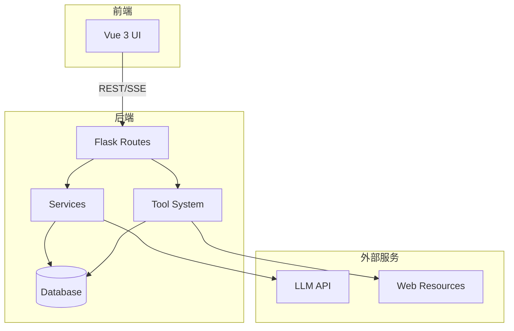
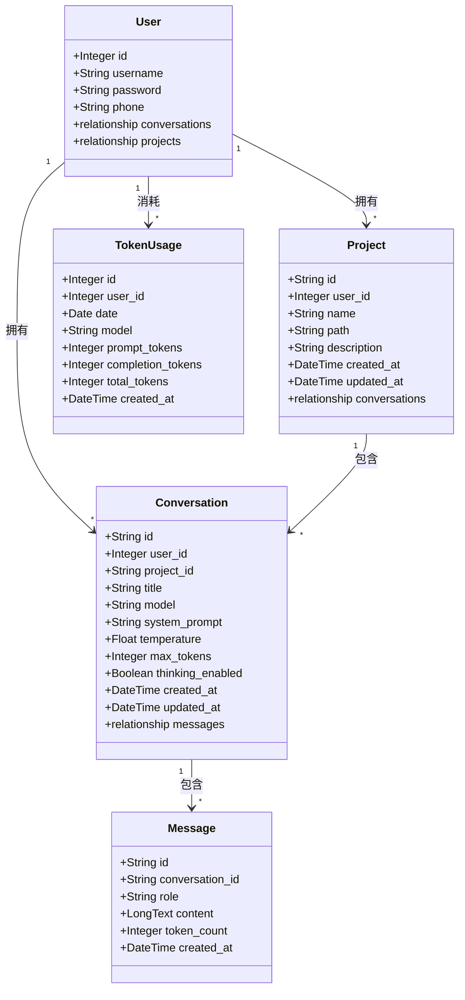
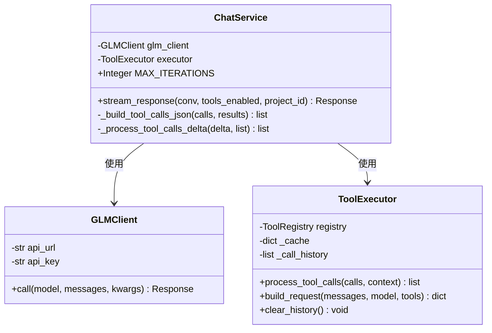
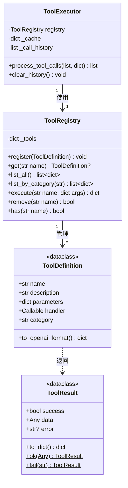

# NanoClaw 后端设计文档

## 架构概览



---

## 项目结构

```
backend/
├── __init__.py          # 应用工厂，数据库初始化
├── models.py            # SQLAlchemy 模型
├── run.py               # 入口文件
├── config.py            # 配置加载器
│
├── routes/              # API 路由
│   ├── __init__.py
│   ├── conversations.py # 会话 CRUD
│   ├── messages.py      # 消息 CRUD + 聊天
│   ├── models.py        # 模型列表
│   ├── projects.py      # 项目管理
│   ├── stats.py         # Token 统计
│   └── tools.py         # 工具列表
│
├── services/            # 业务逻辑
│   ├── __init__.py
│   ├── chat.py          # 聊天补全服务
│   └── glm_client.py    # GLM API 客户端
│
├── tools/               # 工具系统
│   ├── __init__.py
│   ├── core.py          # 核心类
│   ├── factory.py       # 工具装饰器
│   ├── executor.py      # 工具执行器
│   ├── services.py      # 辅助服务
│   └── builtin/         # 内置工具
│       ├── crawler.py   # 网页搜索、抓取
│       ├── data.py      # 计算器、文本、JSON
│       ├── weather.py   # 天气查询
│       ├── file_ops.py  # 文件操作（需要 project_id）
│       └── code.py      # 代码执行
│
├── utils/               # 辅助函数
│   ├── __init__.py
│   ├── helpers.py       # 通用函数
│   └── workspace.py     # 工作目录工具
│
└── migrations/          # 数据库迁移
    └── add_project_support.py
```

---

## 类图

### 核心数据模型



### Message Content JSON 结构

`content` 字段统一使用 JSON 格式存储：

**User 消息：**
```json
{
  "text": "用户输入的文本内容",
  "attachments": [
    {"name": "utils.py", "extension": "py", "content": "def hello()..."}
  ]
}
```

**Assistant 消息：**
```json
{
  "text": "AI 回复的文本内容",
  "thinking": "思考过程（可选）",
  "tool_calls": [
    {
      "id": "call_xxx",
      "type": "function",
      "function": {
        "name": "file_read",
        "arguments": "{\"path\": \"...\"}"
      },
      "result": "{\"content\": \"...\"}",
      "success": true,
      "skipped": false,
      "execution_time": 0.5
    }
  ]
}
```

### 服务层



### 工具系统



---

## 工作目录系统

### 概述

工作目录系统为文件操作工具提供安全隔离，确保所有文件操作都在项目目录内执行。

### 核心函数

```python
# backend/utils/workspace.py

def get_workspace_root() -> Path:
    """获取工作区根目录"""

def get_project_path(project_id: str, project_path: str) -> Path:
    """获取项目绝对路径"""

def validate_path_in_project(path: str, project_dir: Path) -> Path:
    """验证路径在项目目录内（核心安全函数）"""

def create_project_directory(name: str, user_id: int) -> tuple:
    """创建项目目录"""

def delete_project_directory(project_path: str) -> bool:
    """删除项目目录"""

def copy_folder_to_project(source_path: str, project_dir: Path, project_name: str) -> dict:
    """复制文件夹到项目目录"""
```

### 安全机制

`validate_path_in_project()` 是核心安全函数：

```python
def validate_path_in_project(path: str, project_dir: Path) -> Path:
    p = Path(path)
    
    # 相对路径转换为绝对路径
    if not p.is_absolute():
        p = project_dir / p
    
    p = p.resolve()
    
    # 安全检查：确保路径在项目目录内
    try:
        p.relative_to(project_dir.resolve())
    except ValueError:
        raise ValueError(f"Path '{path}' is outside project directory")
    
    return p
```

即使传入恶意路径，后端也会拒绝：
```python
"../../../etc/passwd"  # 尝试跳出项目目录 -> ValueError
"/etc/passwd"         # 绝对路径攻击 -> ValueError
```

### project_id 自动注入

工具执行器自动为文件工具注入 `project_id`：

```python
# backend/tools/executor.py

def process_tool_calls(self, tool_calls, context=None):
    for call in tool_calls:
        name = call["function"]["name"]
        args = json.loads(call["function"]["arguments"])
        
        # 自动注入 project_id
        if context and name.startswith("file_") and "project_id" in context:
            args["project_id"] = context["project_id"]
        
        result = self.registry.execute(name, args)
```

---

## API 总览

### 会话管理

| 方法 | 路径 | 说明 |
|------|------|------|
| `POST` | `/api/conversations` | 创建会话 |
| `GET` | `/api/conversations` | 获取会话列表（游标分页） |
| `GET` | `/api/conversations/:id` | 获取会话详情 |
| `PATCH` | `/api/conversations/:id` | 更新会话 |
| `DELETE` | `/api/conversations/:id` | 删除会话 |

### 消息管理

| 方法 | 路径 | 说明 |
|------|------|------|
| `GET` | `/api/conversations/:id/messages` | 获取消息列表（游标分页） |
| `POST` | `/api/conversations/:id/messages` | 发送消息（SSE 流式） |
| `DELETE` | `/api/conversations/:id/messages/:mid` | 删除消息 |
| `POST` | `/api/conversations/:id/regenerate/:mid` | 重新生成消息 |

### 项目管理

| 方法 | 路径 | 说明 |
|------|------|------|
| `GET` | `/api/projects` | 获取项目列表 |
| `POST` | `/api/projects` | 创建项目 |
| `GET` | `/api/projects/:id` | 获取项目详情 |
| `PUT` | `/api/projects/:id` | 更新项目 |
| `DELETE` | `/api/projects/:id` | 删除项目 |
| `POST` | `/api/projects/upload` | 上传文件夹作为项目 |
| `GET` | `/api/projects/:id/files` | 列出项目文件 |

### 其他

| 方法 | 路径 | 说明 |
|------|------|------|
| `GET` | `/api/models` | 获取模型列表 |
| `GET` | `/api/tools` | 获取工具列表 |
| `GET` | `/api/stats/tokens` | Token 使用统计 |

---

## SSE 事件

| 事件 | 说明 |
|------|------|
| `thinking_start` | 新一轮思考开始，前端应清空之前的思考缓冲 |
| `thinking` | 思维链增量内容（启用时） |
| `message` | 回复内容的增量片段 |
| `tool_calls` | 工具调用信息 |
| `tool_result` | 工具执行结果 |
| `process_step` | 处理步骤（按顺序：thinking/text/tool_call/tool_result），支持穿插显示 |
| `error` | 错误信息 |
| `done` | 回复结束，携带 message_id 和 token_count |

### process_step 事件格式

```json
// 思考过程
{"index": 0, "type": "thinking", "content": "完整思考内容..."}

// 回复文本（可穿插在任意步骤之间）
{"index": 1, "type": "text", "content": "回复文本内容..."}

// 工具调用
{"index": 2, "type": "tool_call", "id": "call_abc123", "name": "web_search", "arguments": "{\"query\": \"...\"}"}

// 工具返回
{"index": 3, "type": "tool_result", "id": "call_abc123", "name": "web_search", "content": "{\"success\": true, ...}", "skipped": false}
```

字段说明：
- `index`: 步骤序号，确保按正确顺序显示
- `type`: 步骤类型（thinking/tool_call/tool_result）
- `id`: 工具调用唯一标识，用于匹配工具调用和返回结果
- `name`: 工具名称
- `content`: 内容或结果
- `skipped`: 工具是否被跳过（失败后跳过）

---

## 数据模型

### User（用户）

| 字段 | 类型 | 说明 |
|------|------|------|
| `id` | Integer | 自增主键 |
| `username` | String(50) | 用户名（唯一） |
| `password` | String(255) | 密码（可为空，支持第三方登录） |
| `phone` | String(20) | 手机号 |

### Project（项目）

| 字段 | 类型 | 说明 |
|------|------|------|
| `id` | String(64) | UUID 主键 |
| `user_id` | Integer | 外键关联 User |
| `name` | String(255) | 项目名称（用户内唯一） |
| `path` | String(512) | 相对路径（如 user_1/my_project） |
| `description` | Text | 项目描述 |
| `created_at` | DateTime | 创建时间 |
| `updated_at` | DateTime | 更新时间 |

### Conversation（会话）

| 字段 | 类型 | 默认值 | 说明 |
|------|------|--------|------|
| `id` | String(64) | UUID | 主键 |
| `user_id` | Integer | - | 外键关联 User |
| `project_id` | String(64) | null | 外键关联 Project（可选） |
| `title` | String(255) | "" | 会话标题 |
| `model` | String(64) | "glm-5" | 模型名称 |
| `system_prompt` | Text | "" | 系统提示词 |
| `temperature` | Float | 1.0 | 采样温度 |
| `max_tokens` | Integer | 65536 | 最大输出 token |
| `thinking_enabled` | Boolean | False | 是否启用思维链 |
| `created_at` | DateTime | now | 创建时间 |
| `updated_at` | DateTime | now | 更新时间 |

### Message（消息）

| 字段 | 类型 | 说明 |
|------|------|------|
| `id` | String(64) | UUID 主键 |
| `conversation_id` | String(64) | 外键关联 Conversation |
| `role` | String(16) | user/assistant/system/tool |
| `content` | LongText | JSON 格式内容（见上方结构说明） |
| `token_count` | Integer | Token 数量 |
| `created_at` | DateTime | 创建时间 |

### TokenUsage（Token 使用统计）

| 字段 | 类型 | 说明 |
|------|------|------|
| `id` | Integer | 自增主键 |
| `user_id` | Integer | 外键关联 User |
| `date` | Date | 统计日期 |
| `model` | String(64) | 模型名称 |
| `prompt_tokens` | Integer | 输入 token |
| `completion_tokens` | Integer | 输出 token |
| `total_tokens` | Integer | 总 token |
| `created_at` | DateTime | 创建时间 |

---

## 分页机制

所有列表接口使用**游标分页**：

```
GET /api/conversations?limit=20&cursor=conv_abc123
```

响应：
```json
{
  "code": 0,
  "data": {
    "items": [...],
    "next_cursor": "conv_def456",
    "has_more": true
  }
}
```

- `limit`：每页数量（会话默认 20，消息默认 50，最大 100）
- `cursor`：上一页最后一条的 ID

---

## 错误码

| Code | 说明 |
|------|------|
| `0` | 成功 |
| `400` | 请求参数错误 |
| `404` | 资源不存在 |
| `500` | 服务器错误 |

错误响应：
```json
{
  "code": 404,
  "message": "conversation not found"
}
```

---

## 配置文件

配置文件：`config.yml`

```yaml
# 服务端口
backend_port: 3000
frontend_port: 4000

# LLM API
api_key: your-api-key
api_url: https://open.bigmodel.cn/api/paas/v4/chat/completions

# 工作区根目录
workspace_root: ./workspaces

# 数据库
db_type: mysql  # mysql, sqlite, postgresql
db_host: localhost
db_port: 3306
db_user: root
db_password: ""
db_name: nano_claw
db_sqlite_file: app.db  # SQLite 时使用
```