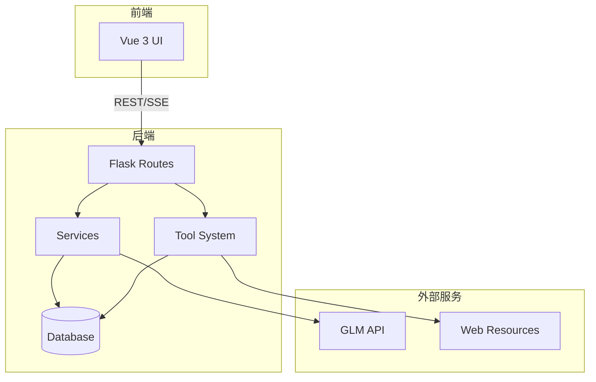
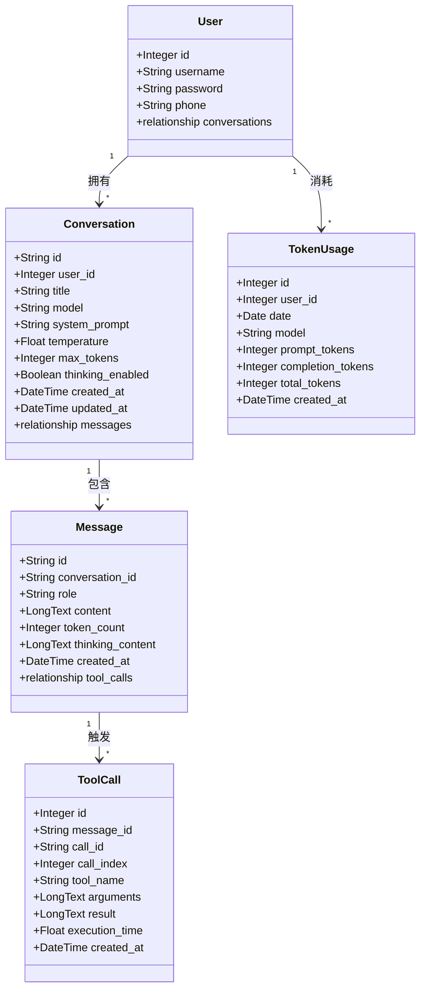
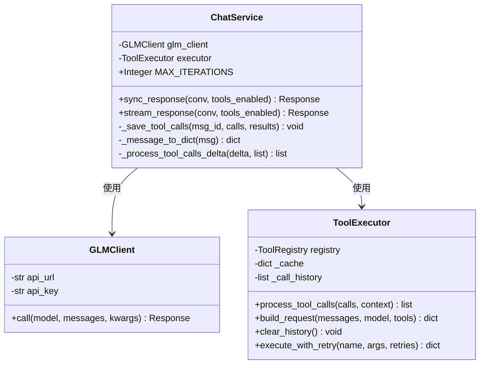
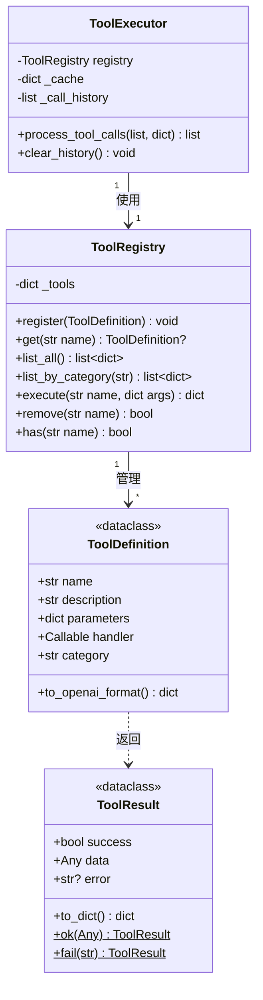

# NanoClaw 后端设计文档

## 架构概览



---

## 项目结构

```
backend/
├── __init__.py          # 应用工厂，数据库初始化
├── models.py            # SQLAlchemy 模型
├── run.py               # 入口文件
├── config.py            # 配置加载器
│
├── routes/              # API 路由
│   ├── __init__.py
│   ├── conversations.py # 会话 CRUD
│   ├── messages.py      # 消息 CRUD + 聊天
│   ├── models.py        # 模型列表
│   ├── stats.py         # Token 统计
│   └── tools.py         # 工具列表
│
├── services/            # 业务逻辑
│   ├── __init__.py
│   ├── chat.py          # 聊天补全服务
│   └── glm_client.py    # GLM API 客户端
│
├── tools/               # 工具系统
│   ├── __init__.py
│   ├── core.py          # 核心类
│   ├── factory.py       # 工具装饰器
│   ├── executor.py      # 工具执行器
│   ├── services.py      # 辅助服务
│   └── builtin/         # 内置工具
│       ├── crawler.py   # 网页搜索、抓取
│       ├── data.py      # 计算器、文本、JSON
│       ├── weather.py   # 天气查询
│       ├── file_ops.py  # 文件操作
│       └── code.py      # 代码执行
│
└── utils/               # 辅助函数
    ├── __init__.py
    └── helpers.py       # 通用函数
```

---

## 类图

### 核心数据模型



### 服务层



### 工具系统



---

## API 总览

### 会话管理

| 方法 | 路径 | 说明 |
|------|------|------|
| `POST` | `/api/conversations` | 创建会话 |
| `GET` | `/api/conversations` | 获取会话列表（游标分页） |
| `GET` | `/api/conversations/:id` | 获取会话详情 |
| `PATCH` | `/api/conversations/:id` | 更新会话 |
| `DELETE` | `/api/conversations/:id` | 删除会话 |

### 消息管理

| 方法 | 路径 | 说明 |
|------|------|------|
| `GET` | `/api/conversations/:id/messages` | 获取消息列表（游标分页） |
| `POST` | `/api/conversations/:id/messages` | 发送消息（支持 SSE 流式） |
| `DELETE` | `/api/conversations/:id/messages/:mid` | 删除消息 |

### 其他

| 方法 | 路径 | 说明 |
|------|------|------|
| `GET` | `/api/models` | 获取模型列表 |
| `GET` | `/api/tools` | 获取工具列表 |
| `GET` | `/api/stats/tokens` | Token 使用统计 |

---

## SSE 事件

| 事件 | 说明 |
|------|------|
| `thinking` | 思维链增量内容（启用时） |
| `message` | 回复内容的增量片段 |
| `tool_calls` | 工具调用信息 |
| `tool_result` | 工具执行结果 |
| `error` | 错误信息 |
| `done` | 回复结束，携带 message_id 和 token_count |

---

## 数据模型

### User（用户）

| 字段 | 类型 | 说明 |
|------|------|------|
| `id` | Integer | 自增主键 |
| `username` | String(50) | 用户名（唯一） |
| `password` | String(255) | 密码（可为空，支持第三方登录） |
| `phone` | String(20) | 手机号 |

### Conversation（会话）

| 字段 | 类型 | 默认值 | 说明 |
|------|------|--------|------|
| `id` | String(64) | UUID | 主键 |
| `user_id` | Integer | - | 外键关联 User |
| `title` | String(255) | "" | 会话标题 |
| `model` | String(64) | "glm-5" | 模型名称 |
| `system_prompt` | Text | "" | 系统提示词 |
| `temperature` | Float | 1.0 | 采样温度 |
| `max_tokens` | Integer | 65536 | 最大输出 token |
| `thinking_enabled` | Boolean | False | 是否启用思维链 |
| `created_at` | DateTime | now | 创建时间 |
| `updated_at` | DateTime | now | 更新时间 |

### Message（消息）

| 字段 | 类型 | 说明 |
|------|------|------|
| `id` | String(64) | UUID 主键 |
| `conversation_id` | String(64) | 外键关联 Conversation |
| `role` | String(16) | user/assistant/system/tool |
| `content` | LongText | 消息内容 |
| `token_count` | Integer | Token 数量 |
| `thinking_content` | LongText | 思维链内容 |
| `created_at` | DateTime | 创建时间 |

### ToolCall（工具调用）

| 字段 | 类型 | 说明 |
|------|------|------|
| `id` | Integer | 自增主键 |
| `message_id` | String(64) | 外键关联 Message |
| `call_id` | String(64) | LLM 返回的工具调用 ID |
| `call_index` | Integer | 消息内的调用顺序 |
| `tool_name` | String(64) | 工具名称 |
| `arguments` | LongText | JSON 参数 |
| `result` | LongText | JSON 结果 |
| `execution_time` | Float | 执行时间（秒） |
| `created_at` | DateTime | 创建时间 |

### TokenUsage（Token 使用统计）

| 字段 | 类型 | 说明 |
|------|------|------|
| `id` | Integer | 自增主键 |
| `user_id` | Integer | 外键关联 User |
| `date` | Date | 统计日期 |
| `model` | String(64) | 模型名称 |
| `prompt_tokens` | Integer | 输入 token |
| `completion_tokens` | Integer | 输出 token |
| `total_tokens` | Integer | 总 token |
| `created_at` | DateTime | 创建时间 |

---

## 分页机制

所有列表接口使用**游标分页**：

```
GET /api/conversations?limit=20&cursor=conv_abc123
```

响应：
```json
{
  "code": 0,
  "data": {
    "items": [...],
    "next_cursor": "conv_def456",
    "has_more": true
  }
}
```

- `limit`：每页数量（会话默认 20，消息默认 50，最大 100）
- `cursor`：上一页最后一条的 ID

---

## 错误码

| Code | 说明 |
|------|------|
| `0` | 成功 |
| `400` | 请求参数错误 |
| `404` | 资源不存在 |
| `500` | 服务器错误 |

错误响应：
```json
{
  "code": 404,
  "message": "conversation not found"
}
```

---

## 配置文件

配置文件：`config.yml`

```yaml
# 服务端口
backend_port: 3000
frontend_port: 4000

# GLM API
api_key: your-api-key
api_url: https://open.bigmodel.cn/api/paas/v4/chat/completions

# 数据库
db_type: mysql  # mysql, sqlite, postgresql
db_host: localhost
db_port: 3306
db_user: root
db_password: ""
db_name: nano_claw
db_sqlite_file: app.db  # SQLite 时使用
```
