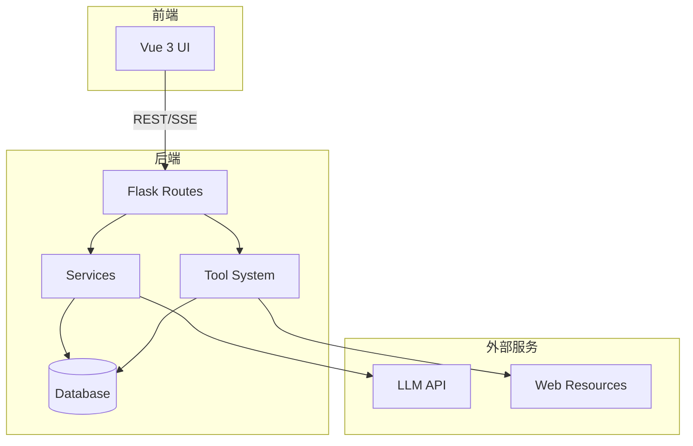
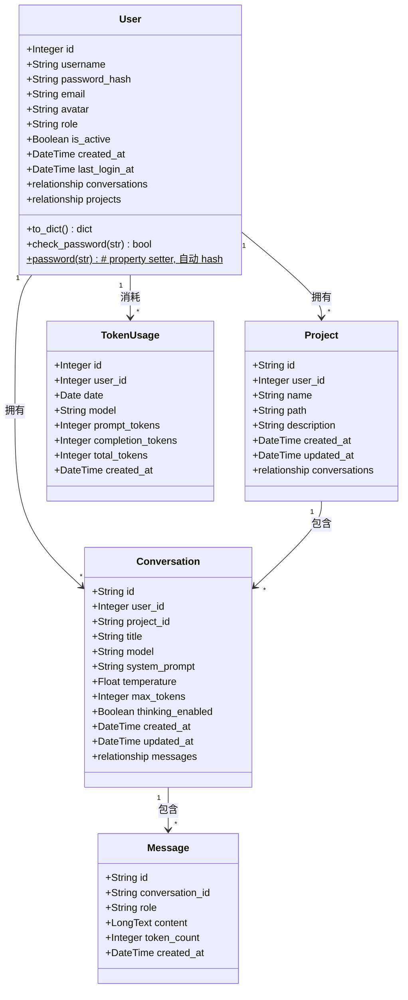
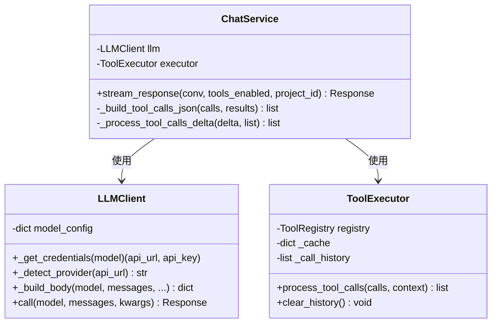
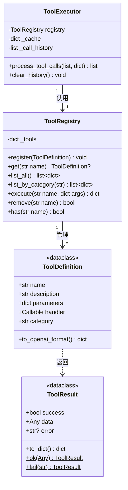
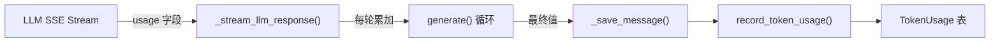
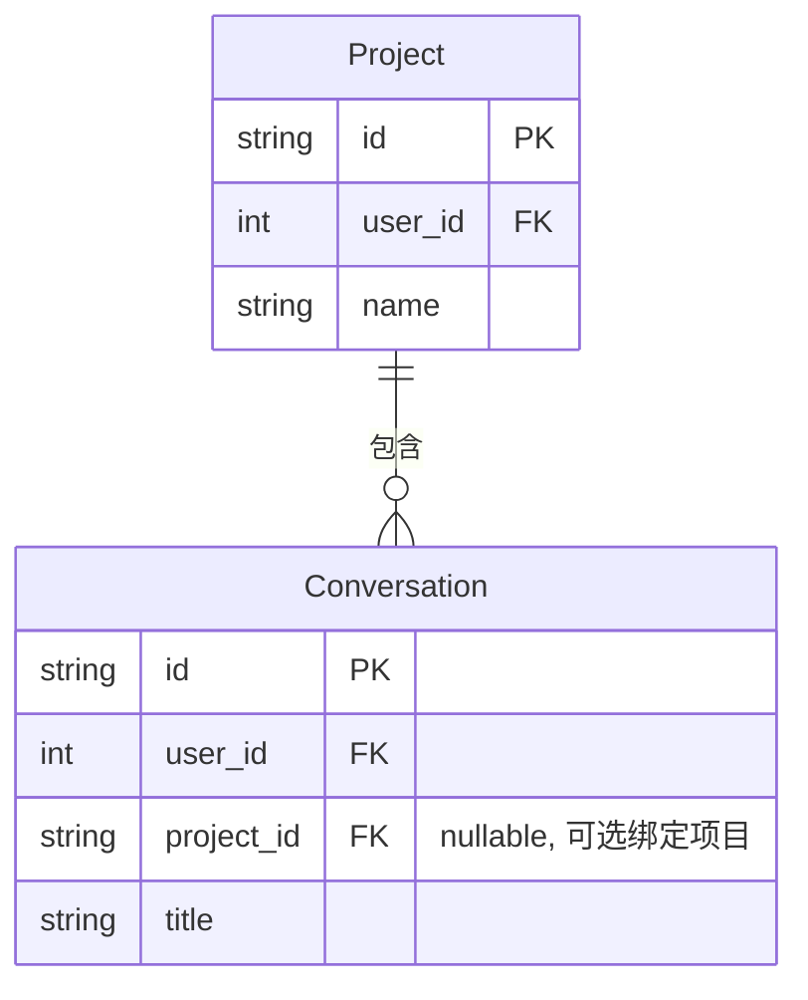

# NanoClaw 后端设计文档

## 架构概览



---

## 项目结构

```
backend/
├── __init__.py          # 应用工厂，数据库初始化
├── models.py            # SQLAlchemy 模型
├── run.py               # 入口文件
├── config.py            # 配置加载器
│
├── routes/              # API 路由
│   ├── __init__.py
│   ├── auth.py          # 认证（登录/注册/JWT）
│   ├── conversations.py # 会话 CRUD
│   ├── messages.py      # 消息 CRUD + 聊天
│   ├── models.py        # 模型列表
│   ├── projects.py      # 项目管理
│   ├── stats.py         # Token 统计
│   └── tools.py         # 工具列表
│
├── services/            # 业务逻辑
│   ├── __init__.py
│   ├── chat.py          # 聊天补全服务
│   └── llm_client.py    # OpenAI 兼容 LLM API 客户端
│
├── tools/               # 工具系统
│   ├── __init__.py
│   ├── core.py          # 核心类
│   ├── factory.py       # 工具装饰器
│   ├── executor.py      # 工具执行器
│   ├── services.py      # 辅助服务
│   └── builtin/         # 内置工具
│       ├── crawler.py   # 网页搜索、抓取
│       ├── data.py      # 计算器、文本、JSON
│       ├── weather.py   # 天气查询
│       ├── file_ops.py  # 文件操作（project_id 自动注入）
│       └── code.py      # 代码执行
│
├── utils/               # 辅助函数
│   ├── __init__.py
│   ├── helpers.py       # 通用函数
│   └── workspace.py     # 工作目录工具
```

---

## 类图

### 核心数据模型



### Message Content JSON 结构

`content` 字段统一使用 JSON 格式存储：

**User 消息：**

```json
{
  "text": "用户输入的文本内容",
  "attachments": [
    {
    "name": "utils.py", 
    "extension": "py", 
    "content": "def hello()..."
    }
  ]
}
```

**Assistant 消息：**

```json
{
  "text": "AI 回复的文本内容",
  "tool_calls": [
    {
      "id": "call_xxx",
      "type": "function",
      "function": {
        "name": "file_read",
        "arguments": "{\"path\": \"...\"}"
      },
      "result": "{\"content\": \"...\"}",
      "success": true,
      "skipped": false,
      "execution_time": 0.5
    }
  ],
  "steps": [
    {
      "id": "step-0",
      "index": 0,
      "type": "thinking",
      "content": "第一轮思考过程..."
    },
    {
      "id": "step-1",
      "index": 1,
      "type": "text",
      "content": "工具调用前的文本..."
    },
    {
      "id": "step-2",
      "index": 2,
      "type": "tool_call",
      "id_ref": "call_abc123",
      "name": "web_search",
      "arguments": "{\"query\": \"...\"}"
    },
    {
      "id": "step-3",
      "index": 3,
      "type": "tool_result",
      "id_ref": "call_abc123",
      "name": "web_search",
      "content": "{\"success\": true, ...}",
      "skipped": false
    },
    {
      "id": "step-4",
      "index": 4,
      "type": "thinking",
      "content": "第二轮思考过程..."
    },
    {
      "id": "step-5",
      "index": 5,
      "type": "text",
      "content": "最终回复文本..."
    }
  ]
}
```

`steps` 字段是**渲染顺序的唯一数据源**，按 `index` 顺序排列。thinking、text、tool_call、tool_result 可以在多轮迭代中穿插出现。`id_ref` 用于 tool_call 和 tool_result 步骤之间的匹配（对应 LLM 返回的工具调用 ID）。`tool_calls` 字段保留用于向后兼容旧版前端。

### 服务层



### 工具系统



---

## 工作目录系统

### 概述

工作目录系统为文件操作工具提供安全隔离，确保所有文件操作都在项目目录内执行。

### 核心函数

```python
# backend/utils/workspace.py

def get_workspace_root() -> Path:
    """获取工作区根目录"""

def get_project_path(project_id: str, project_path: str) -> Path:
    """获取项目绝对路径"""

def validate_path_in_project(path: str, project_dir: Path) -> Path:
    """验证路径在项目目录内（核心安全函数）"""

def create_project_directory(name: str, user_id: int) -> tuple:
    """创建项目目录"""

def delete_project_directory(project_path: str) -> bool:
    """删除项目目录"""

def copy_folder_to_project(source_path: str, project_dir: Path, project_name: str) -> dict:
    """复制文件夹到项目目录"""

def save_uploaded_files(files, project_dir: Path) -> dict:
    """保存上传文件到项目目录"""
```

### 安全机制

`validate_path_in_project()` 是核心安全函数：

```python
def validate_path_in_project(path: str, project_dir: Path) -> Path:
    p = Path(path)

    # 相对路径转换为绝对路径
    if not p.is_absolute():
        p = project_dir / p

    p = p.resolve()

    # 安全检查：确保路径在项目目录内
    try:
        p.relative_to(project_dir.resolve())
    except ValueError:
        raise ValueError(f"Path '{path}' is outside project directory")

    return p
```

即使传入恶意路径，后端也会拒绝：

```python
"../../../etc/passwd"  # 尝试跳出项目目录 -> ValueError
"/etc/passwd"         # 绝对路径攻击 -> ValueError
```

### project_id 自动注入

工具执行器自动为文件工具注入 `project_id`：

```python
# backend/tools/executor.py

def process_tool_calls(self, tool_calls, context=None):
    for call in tool_calls:
        name = call["function"]["name"]
        args = json.loads(call["function"]["arguments"])

        # 自动注入 project_id
        if context and name.startswith("file_") and "project_id" in context:
            args["project_id"] = context["project_id"]

        result = self.registry.execute(name, args)
```

---

## API 总览

### 认证

| 方法      | 路径                   | 说明                |
| ------- | -------------------- | ----------------- |
| `GET`   | `/api/auth/mode`     | 获取当前认证模式（公开端点）    |
| `POST`  | `/api/auth/login`    | 用户登录，返回 JWT token |
| `POST`  | `/api/auth/register` | 用户注册（仅多用户模式可用）    |
| `GET`   | `/api/auth/profile`  | 获取当前用户信息          |
| `PATCH` | `/api/auth/profile`  | 更新当前用户信息          |

### 会话管理

| 方法       | 路径                       | 说明                              |
| -------- | ------------------------ | ------------------------------- |
| `POST`   | `/api/conversations`     | 创建会话（可选 `project_id` 绑定项目）      |
| `GET`    | `/api/conversations`     | 获取会话列表（可选 `project_id` 筛选，游标分页） |
| `GET`    | `/api/conversations/:id` | 获取会话详情                          |
| `PATCH`  | `/api/conversations/:id` | 更新会话（支持修改 `project_id`）         |
| `DELETE` | `/api/conversations/:id` | 删除会话                            |

### 消息管理

| 方法       | 路径                                       | 说明           |
| -------- | ---------------------------------------- | ------------ |
| `GET`    | `/api/conversations/:id/messages`        | 获取消息列表（游标分页） |
| `POST`   | `/api/conversations/:id/messages`        | 发送消息（SSE 流式） |
| `DELETE` | `/api/conversations/:id/messages/:mid`   | 删除消息         |
| `POST`   | `/api/conversations/:id/regenerate/:mid` | 重新生成消息       |

### 项目管理

| 方法       | 路径                                  | 说明                                                                                       |
| -------- | ----------------------------------- | ---------------------------------------------------------------------------------------- |
| `GET`    | `/api/projects`                     | 获取项目列表（支持 `?cursor=&limit=` 分页）                                                          |
| `POST`   | `/api/projects`                     | 创建项目                                                                                     |
| `GET`    | `/api/projects/:id`                 | 获取项目详情                                                                                   |
| `PUT`    | `/api/projects/:id`                 | 更新项目                                                                                     |
| `DELETE` | `/api/projects/:id`                 | 删除项目                                                                                     |
| `POST`   | `/api/projects/upload`              | 上传文件夹作为项目                                                                                |
| `GET`    | `/api/projects/:id/files`           | 列出项目文件（支持 `?path=subdir` 子目录）                                                            |
| `GET`    | `/api/projects/:id/files/:filepath` | 读取文件内容（文本文件，最大 5 MB）                                                                     |
| `PUT`    | `/api/projects/:id/files/:filepath` | 创建或覆盖文件（Body: `{"content": "..."}`)                                                      |
| `PATCH`  | `/api/projects/:id/files/:filepath` | 重命名或移动文件/目录（Body: `{"new_path": "..."}`)                                               |
| `DELETE` | `/api/projects/:id/files/:filepath` | 删除文件或目录                                                                                  |
| `POST`   | `/api/projects/:id/directories`     | 创建目录（Body: `{"path": "src/utils"}`)                                                      |
| `POST`   | `/api/projects/:id/search`          | 搜索文件内容（Body: `{"query": "...", "path": "", "max_results": 50, "case_sensitive": false}`) |

### 其他

| 方法    | 路径                  | 说明         |
| ----- | ------------------- | ---------- |
| `GET` | `/api/models`       | 获取模型列表     |
| `GET` | `/api/tools`        | 获取工具列表     |
| `GET` | `/api/stats/tokens` | Token 使用统计 |

---

## SSE 事件

| 事件             | 说明                                                                        |
| -------------- | ------------------------------------------------------------------------- |
| `process_step` | 有序处理步骤（thinking/text/tool_call/tool_result），支持穿插显示和实时流式更新。携带 `id`、`index` 确保渲染顺序 |
| `error`        | 错误信息                                                                      |
| `done`         | 回复结束，携带 message_id、token_count 和 suggested_title                            |

> **注意**：`process_step` 是唯一的内容传输事件。thinking/text 步骤在每个 LLM chunk 到达时**增量发送**（前端按 `id` 原地更新），tool_call/tool_result 步骤在工具执行时**追加发送**。所有步骤在迭代结束时存入 DB。

### process_step 事件格式

每个 `process_step` 事件携带一个带 `id`、`index` 和 `type` 的步骤对象。步骤按 `index` 顺序排列，确保前端可以正确渲染穿插的思考、文本和工具调用。

```json
{"id": "step-0", "index": 0, "type": "thinking", "content": "完整思考内容..."}


{"id": "step-1", "index": 1, "type": "text", "content": "回复文本内容..."}

{"id": "step-2", "index": 2, "type": "tool_call", "id_ref": "call_abc123", "name": "web_search", "arguments": "{\"query\": \"...\"}"}

{"id": "step-3", "index": 3, "type": "tool_result", "id_ref": "call_abc123", "name": "web_search", "content": "{\"success\": true, ...}", "skipped": false}
```

字段说明：

| 字段          | 说明                                                     |
| ----------- | ------------------------------------------------------ |
| `id`        | 步骤唯一标识（格式 `step-{index}`），用于前端 key                     |
| `index`     | 步骤序号，确保按正确顺序显示                                         |
| `type`      | 步骤类型：`thinking` / `text` / `tool_call` / `tool_result` |
| `id_ref`    | 工具调用引用 ID（仅 tool_call/tool_result），用于匹配调用与结果           |
| `name`      | 工具名称（仅 tool_call/tool_result）                          |
| `arguments` | 工具调用参数 JSON 字符串（仅 tool_call）                           |
| `content`   | 内容（thinking 的思考内容、text 的文本、tool_result 的返回结果）          |
| `skipped`   | 工具是否被跳过（仅 tool_result）                                 |

### 多轮迭代中的步骤顺序

一次完整的 LLM 交互可能经历多轮工具调用循环，每轮产生的步骤按以下顺序追加：

```
迭代 1:  thinking → text → tool_call → tool_result
迭代 2:  thinking → text → tool_call → tool_result
...
最终轮:  thinking → text（无工具调用，结束）
```

所有步骤通过全局递增的 `index` 保证顺序。后端在完成所有迭代后，将这些步骤存入 `content_json["steps"]` 数组写入数据库。前端页面刷新时从 API 加载消息，`message_to_dict` 提取 `steps` 字段映射为 `process_steps` 返回，ProcessBlock 组件按 `index` 顺序渲染。

### done 事件格式

```json
{"message_id": "msg-uuid", "token_count": 1234, "suggested_title": "分析数据"}
```

| 字段               | 说明                                    |
| ---------------- | ------------------------------------- |
| `message_id`     | 消息 UUID（已入库）                          |
| `token_count`    | 总输出 token 数（跨所有迭代累积）                  |
| `suggested_title` | 建议会话标题（从首条用户消息提取，无标题时为 `"新对话"`，已有标题时为 `null`） |

### error 事件格式

```json
{"content": "exceeded maximum tool call iterations"}
```

| 字段        | 说明                    |
| --------- | --------------------- |
| `content` | 错误信息字符串，前端展示给用户或打印到控制台 |

### 前端 SSE 解析机制

前端不使用浏览器原生 `EventSource`（仅支持 GET），而是通过 `fetch` + `ReadableStream` 实现 POST 请求的 SSE 解析（`frontend/src/api/index.js`）：

1. **读取**：通过 `response.body.getReader()` 获取可读流，循环 `reader.read()` 读取二进制 chunk
2. **解码拼接**：`TextDecoder` 将二进制解码为 UTF-8 字符串，追加到 `buffer`（处理跨 chunk 的不完整行）
3. **切行**：按 `\n` 分割，最后一段保留在 `buffer` 中（可能是不完整的 SSE 行）
4. **解析分发**：逐行匹配 `event: xxx` 设置事件类型，`data: {...}` 解析 JSON 后分发到对应回调（`onProcessStep` / `onDone` / `onError`）

```
后端 yield:  event: process_step\ndata: {"id":"step-0","type":"thinking","content":"..."}\n\n
                        ↓ TCP（可能跨多个网络包）
reader.read(): [二进制片段1] → [二进制片段2] → ...
                        ↓
buffer 拼接:   "event: process_step\ndata: {\"id\":\"step-0\",...}\n\n"
                        ↓ split('\n')
逐行解析:      event: → "process_step"
              data:   → JSON.parse → onProcessStep(data)
```

---

## 数据模型

### User（用户）

| 字段              | 类型          | 默认值    | 说明                           |
| --------------- | ----------- | ------ | ---------------------------- |
| `id`            | Integer     | -      | 自增主键                         |
| `username`      | String(50)  | -      | 用户名（唯一）                      |
| `password_hash` | String(255) | null   | 密码哈希（可为空，支持 API-key-only 认证） |
| `email`         | String(120) | null   | 邮箱（唯一）                       |
| `avatar`        | String(512) | null   | 头像 URL                       |
| `role`          | String(20)  | "user" | 角色：`user` / `admin`          |
| `is_active`     | Boolean     | true   | 是否激活                         |
| `created_at`    | DateTime    | now    | 创建时间                         |
| `last_login_at` | DateTime    | null   | 最后登录时间                       |

`password` 通过 property setter 自动调用 `werkzeug` 的 `generate_password_hash` 存储，通过 `check_password()` 方法验证。

### Project（项目）

| 字段            | 类型          | 说明                        |
| ------------- | ----------- | ------------------------- |
| `id`          | String(64)  | UUID 主键                   |
| `user_id`     | Integer     | 外键关联 User                 |
| `name`        | String(255) | 项目名称（用户内唯一）               |
| `path`        | String(512) | 相对路径（如 user_1/my_project） |
| `description` | Text        | 项目描述                      |
| `created_at`  | DateTime    | 创建时间                      |
| `updated_at`  | DateTime    | 更新时间                      |

### Conversation（会话）

| 字段                 | 类型          | 默认值     | 说明               |
| ------------------ | ----------- | ------- | ---------------- |
| `id`               | String(64)  | UUID    | 主键               |
| `user_id`          | Integer     | -       | 外键关联 User        |
| `project_id`       | String(64)  | null    | 外键关联 Project（可选） |
| `title`            | String(255) | ""      | 会话标题             |
| `model`            | String(64)  | "glm-5" | 模型名称             |
| `system_prompt`    | Text        | ""      | 系统提示词            |
| `temperature`      | Float       | 1.0     | 采样温度             |
| `max_tokens`       | Integer     | 65536   | 最大输出 token       |
| `thinking_enabled` | Boolean     | False   | 是否启用思维链          |
| `created_at`       | DateTime    | now     | 创建时间             |
| `updated_at`       | DateTime    | now     | 更新时间             |

### Message（消息）

| 字段                | 类型         | 说明                                               |
| ----------------- | ---------- | ------------------------------------------------ |
| `id`              | String(64) | UUID 主键                                          |
| `conversation_id` | String(64) | 外键关联 Conversation                                |
| `role`            | String(16) | user/assistant/system/tool                       |
| `content`         | LongText   | JSON 格式内容（见上方结构说明），assistant 消息包含 `steps` 有序步骤数组 |
| `token_count`     | Integer    | Token 数量                                         |
| `created_at`      | DateTime   | 创建时间                                             |

`message_to_dict()` 辅助函数负责解析 `content` JSON，并提取 `steps` 字段映射为 `process_steps` 返回给前端，确保页面刷新后仍能按正确顺序渲染穿插的思考、文本和工具调用。

### TokenUsage（Token 使用统计）

| 字段                  | 类型         | 说明        |
| ------------------- | ---------- | --------- |
| `id`                | Integer    | 自增主键      |
| `user_id`           | Integer    | 外键关联 User |
| `date`              | Date       | 统计日期      |
| `model`             | String(64) | 模型名称      |
| `prompt_tokens`     | Integer    | 输入 token  |
| `completion_tokens` | Integer    | 输出 token  |
| `total_tokens`      | Integer    | 总 token   |
| `created_at`        | DateTime   | 创建时间      |

---

## Token 用量计算

### 术语定义

| 术语 | 说明 |
| --- | --- |
| `prompt_tokens` | 发给模型的输入 token 数量（包括 system prompt、历史消息、工具定义、工具结果等全部上下文） |
| `completion_tokens` | 模型生成的输出 token 数量（包括 thinking 内容、正文回复、工具调用 JSON） |
| `total_tokens` | `prompt_tokens + completion_tokens` |

### 计算流程

一次完整的对话可能经历多轮工具调用迭代，每轮都会向 LLM 发送请求并收到响应。Token 用量计算分为三个阶段：



#### 1. 流式解析 — 从 SSE chunks 中提取

LLM API 在流的最后一个 chunk 中返回 `usage` 字段（需要在请求中设置 `stream_options` 才有，否则为空）：

```python
# chat.py: _stream_llm_response()
usage = chunk.get("usage", {})
if usage:
    token_count = usage.get("completion_tokens", 0)      # 本轮输出 token
    prompt_tokens = usage.get("prompt_tokens", 0)         # 本轮输入 token
```

#### 2. 迭代累加 — generate() 循环

每轮迭代结束后，将本轮的 prompt 和 completion token 累加到总计：

```python
# chat.py: generate()
total_prompt_tokens += prompt_tokens        # 累加每轮 prompt
total_completion_tokens += completion_tokens  # 累加每轮 completion
```

#### 3. 记录到数据库

最终调用 `record_token_usage()` 写入 TokenUsage 表，同时 Message 表也记录 completion token：

```python
# chat.py: _save_message()
msg = Message(token_count=total_completion_tokens)   # Message 表仅记录 completion
record_token_usage(user_id, model, total_prompt_tokens, total_completion_tokens)
```

### 多轮迭代示例

一次涉及工具调用的对话（如：用户提问 → LLM 调用搜索 → LLM 生成回复）：

```
迭代 1: prompt=800, completion=150  (LLM 决定调用 web_search)
迭代 2: prompt=1500, completion=300  (LLM 根据搜索结果生成最终回复)

─────────────────────────────────────────
累加结果:
  total_prompt_tokens     = 800 + 1500 = 2300
  total_completion_tokens = 150 + 300  = 450
─────────────────────────────────────────
```

> **注意**：`prompt_tokens` 的累加意味着存在重复计算 — 第 2 轮的 prompt 包含了第 1 轮的上下文，累加后 `total_prompt_tokens` 大于本次对话的真实输入 token 总量（历史部分被多次计算）。这是因为每轮请求是独立的 API 调用，各自计费。如果需要精确的单次对话输入 token，可以只取最后一轮的 `prompt_tokens`。

### 存储位置

| 位置 | 存什么 | 粒度 |
| --- | --- | --- |
| `Message.token_count` | `total_completion_tokens`（仅输出） | 单条消息 |
| `TokenUsage` 表 | `prompt_tokens` + `completion_tokens` + `total_tokens` | 按 user + 日期 + model 聚合 |

`TokenUsage` 按 **user_id + 日期 + model** 维度聚合，同一天同一模型的多次对话会累加到同一条记录：

```python
# helpers.py: record_token_usage()
if existing:
    existing.prompt_tokens += prompt_tokens
    existing.completion_tokens += completion_tokens
    existing.total_tokens += prompt_tokens + completion_tokens
else:
    create new TokenUsage record
```

---

## 分页机制

所有列表接口使用**游标分页**：

```
GET /api/conversations?limit=20&cursor=conv_abc123
```

响应：

```json
{
  "code": 0,
  "data": {
    "items": [...],
    "next_cursor": "conv_def456",
    "has_more": true
  }
}
```

- `limit`：每页数量（会话默认 20，消息默认 50，最大 100）
- `cursor`：上一页最后一条的 ID

---

## 认证机制

### 概述

系统支持**单用户模式**和**多用户模式**，通过 `config.yml` 中的 `auth_mode` 切换。

### 单用户模式（`auth_mode: single`，默认）

- **无需登录**，前端不需要传 token
- 后端自动创建一个 `username="default"`、`role="admin"` 的用户
- 每次请求通过 `before_request` 钩子自动将 `g.current_user` 设为该默认用户
- 所有路由从 `g.current_user` 获取当前用户，无需前端传递 `user_id`

### 多用户模式（`auth_mode: multi`）

- 除公开端点外，所有请求必须在 `Authorization` 头中携带 JWT token
- 用户通过 `/api/auth/register` 注册、`/api/auth/login` 登录获取 token
- Token 有效期 7 天，过期需重新登录
- 用户只能访问自己的数据（对话、项目、统计等）

### 认证流程

```
单用户模式：
  请求 → before_request → 查找/创建 default 用户 → g.current_user → 路由处理

多用户模式：
  请求 → before_request → 提取 Authorization header → 验证 JWT → 查找用户 → g.current_user → 路由处理
                                                                    ↓ 失败
                                                                返回 401
```

### 公开端点（无需认证）

| 端点                        | 说明   |
| ------------------------- | ---- |
| `POST /api/auth/login`    | 登录   |
| `POST /api/auth/register` | 注册   |
| `GET /api/models`         | 模型列表 |
| `GET /api/tools`          | 工具列表 |

### 前端适配

前端 API 层（`frontend/src/api/index.js`）已预留 token 管理：

- `getToken()` / `setToken(token)` / `clearToken()`
- 所有请求自动附带 `Authorization: Bearer <token>`（token 为空时不发送）
- 收到 401 时自动清除 token

切换到多用户模式时，只需补充登录/注册页面 UI。

---

| Code  | 说明                     |
| ----- | ---------------------- |
| `0`   | 成功                     |
| `400` | 请求参数错误                 |
| `401` | 未认证（多用户模式下缺少或无效 token） |
| `403` | 禁止访问（账户禁用、单用户模式下注册等）   |
| `404` | 资源不存在                  |
| `409` | 资源冲突（用户名/邮箱已存在）        |
| `500` | 服务器错误                  |

错误响应：

```json
{
  "code": 404,
  "message": "conversation not found"
}
```

---

## 项目-对话关联机制

### 设计目标

将项目（Project）和对话（Conversation）建立**持久绑定关系**，实现：

1. 创建对话时自动绑定当前选中的项目
2. 对话列表支持按项目筛选/分组
3. 工具执行自动使用对话所属项目的上下文，无需 AI 每次询问 `project_id`
4. 支持对话在项目间迁移

### 数据模型（已存在）



`Conversation.project_id` 是 nullable 的外键：

- `null` = 未绑定项目（通用对话，文件工具不可用）
- 非 null = 绑定到特定项目（工具自动使用该项目的工作空间）

### API 设计

#### 创建对话 `POST /api/conversations`

```json
// Request
{
  "title": "新对话",
  "project_id": "uuid-of-project"  // 可选，传入则绑定项目
}

// Response
{
  "code": 0,
  "data": {
    "id": "conv-uuid",
    "project_id": "uuid-of-project",  // 回显绑定
    "project_name": "AlgoLab",         // 附带项目名称，方便前端显示
    "title": "新对话",
    ...
  }
}
```

#### 对话列表 `GET /api/conversations`

支持按项目筛选：

```
GET /api/conversations?project_id=xxx    # 仅返回该项目的对话
GET /api/conversations                    # 返回所有对话（当前行为）
```

响应中附带项目信息：

```json
{
  "code": 0,
  "data": {
    "items": [
      {
        "id": "conv-1",
        "project_id": "proj-1",
        "project_name": "AlgoLab",
        "title": "分析数据",
        ...
      },
      {
        "id": "conv-2",
        "project_id": null,
        "project_name": null,
        "title": "闲聊",
        ...
      }
    ]
  }
}
```

#### 更新对话 `PATCH /api/conversations/:id`

支持修改 `project_id`（迁移对话到其他项目）：

```json
{
  "project_id": "new-project-uuid"  // 设为 null 可解绑
}
```

#### 发送消息 `POST /api/conversations/:id/messages`

`project_id` 优先级：

1. 请求体中的 `project_id`（前端显式传递）
2. `conversation.project_id`（对话绑定的项目，自动回退）
3. `null`（无项目上下文，文件工具报错提示）

```python
# 伪代码
effective_project_id = request_project_id or conv.project_id
context = {"project_id": effective_project_id} if effective_project_id else None
```

这样 AI **不需要**知道 `project_id`，后端会自动注入。建议将 `project_id` 从文件工具的 `required` 参数列表中移除，改为后端自动注入。

### 工具上下文自动注入（已实施）

`project_id` 已从所有文件工具的 `required` 参数列表中移除，改为后端自动注入。

**实施细节：**

1. **工具 Schema**：`file_*` 工具不再声明 `project_id` 参数，AI 不会看到也不会询问
2. **自动注入**：`ToolExecutor` 在执行文件工具时自动从 context 注入 `project_id`
3. **Context 构建**：`ChatService` 根据请求或对话绑定自动构建 `context = {"project_id": ...}`

```python
# 工具定义 - 不再声明 project_id
parameters = {
    "properties": {
        "path": {"type": "string", "description": "文件路径"},
        "pattern": {"type": "string", "description": "过滤模式", "default": "*"}
    },
    "required": []  # 所有参数有默认值，project_id 完全透明
}

# ToolExecutor 自动注入（已有逻辑）
if name.startswith("file_") and context and "project_id" in context:
    args["project_id"] = context["project_id"]
```

### UI 交互设计

#### 侧边栏布局

```
┌─────────────────────┐
│ [📁 AlgoLab    ▼]   │  ← 项目选择器
├─────────────────────┤
│ [+ 新对话]           │
├─────────────────────┤
│  📎 分析数据   3条   │  ← 属于当前项目的对话
│  📎 优化算法   5条   │
│  📎 调试测试   2条   │
├─────────────────────┤
│ 选择其他项目查看对话  │  ← 或切换项目
└─────────────────────┘
```

**交互规则：**

1. 顶部项目选择器决定**当前工作空间**
2. 选中项目后，对话列表**仅显示该项目的对话**
3. 创建新对话时**自动绑定**当前项目
4. 未选中项目时显示全部对话
5. 切换项目不切换当前对话（保持对话焦点）

#### 对话项显示

- 对话标题前显示小圆点颜色，区分所属项目（可选）
- 悬浮/详情中显示所属项目名称

---

## 配置文件

配置文件：`config.yml`

```yaml
# 服务端口
backend_port: 3000
frontend_port: 4000

# 智能体循环最大迭代次数（工具调用轮次上限，默认 5）
max_iterations: 15

# 可用模型列表（每个模型必须指定 api_url 和 api_key）
# 支持任何 OpenAI 兼容 API（DeepSeek、GLM、OpenAI、Moonshot、Qwen 等）
models:
  - id: deepseek-chat
    name: DeepSeek V3
    api_url: https://api.deepseek.com/chat/completions
    api_key: sk-xxx
  - id: glm-5
    name: GLM-5
    api_url: https://open.bigmodel.cn/api/paas/v4/chat/completions
    api_key: xxx

# 默认模型（必须存在于 models 列表中）
default_model: deepseek-chat

# 工作区根目录
workspace_root: ./workspaces

# 认证模式（可选，默认 single）
# single: 单用户模式，无需登录，自动创建默认用户
# multi: 多用户模式，需要 JWT 认证
auth_mode: single
# JWT 密钥（仅多用户模式使用，生产环境请替换为随机值）
jwt_secret: nano-claw-default-secret-change-in-production

# 数据库（支持 mysql, sqlite, postgresql）
db_type: sqlite

# MySQL/PostgreSQL 配置（sqlite 模式下忽略）
db_host: localhost
db_port: 3306
db_user: root
db_password: "123456"
db_name: nano_claw

# SQLite 配置（mysql/postgresql 模式下忽略）
db_sqlite_file: nano_claw.db
```

> **说明**：
> - `api_key` 和 `api_url` 支持环境变量替换，例如 `api_key: ${DEEPSEEK_API_KEY}`
> - 不配置 `auth_mode` 时默认为 `single` 模式
> - `LLMClient` 会根据 `api_url` 自动检测提供商（DeepSeek / GLM / OpenAI），并适配不同的参数（max_tokens 上限、thinking 参数、stream_options 等）
> - 遇到 429 限流时自动重试（最多 3 次，指数退避）