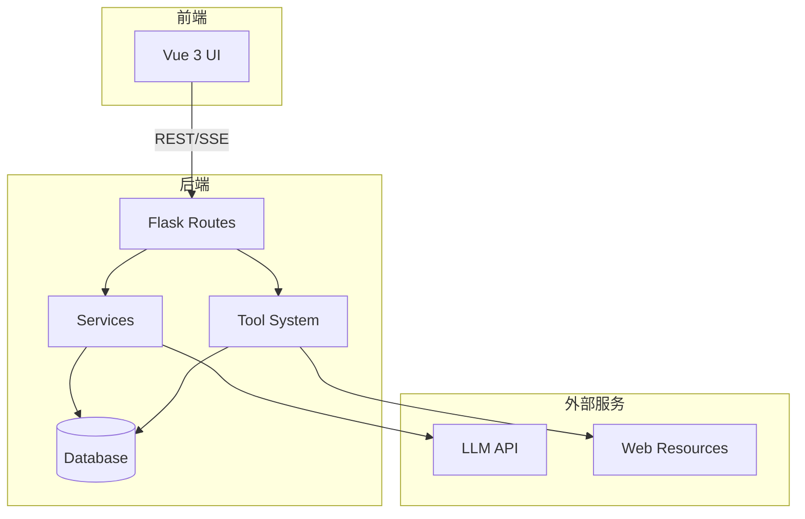
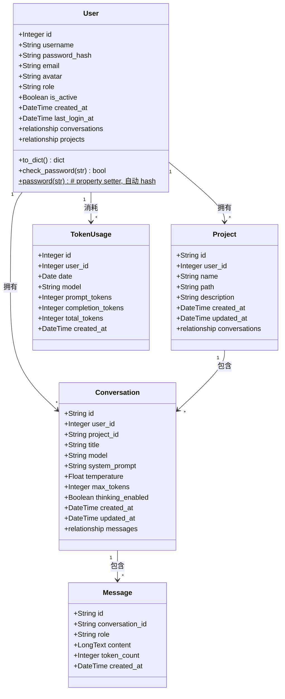
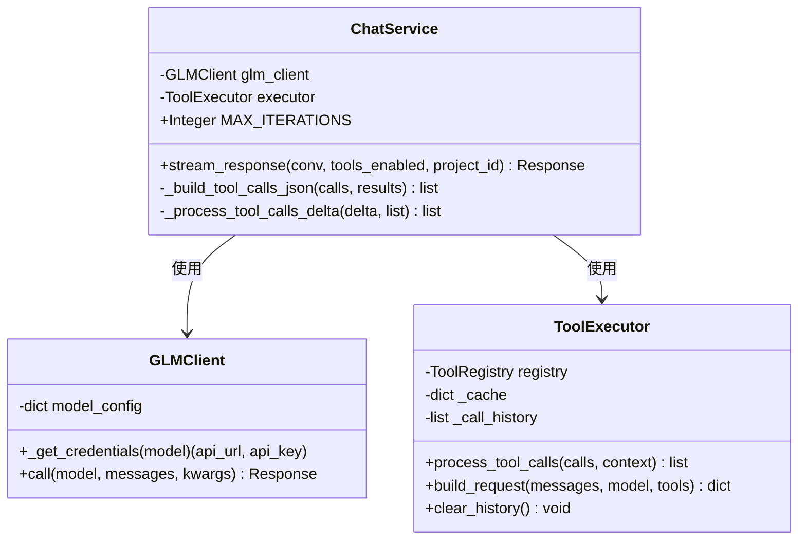
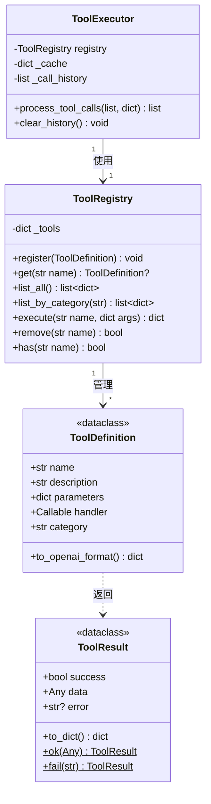
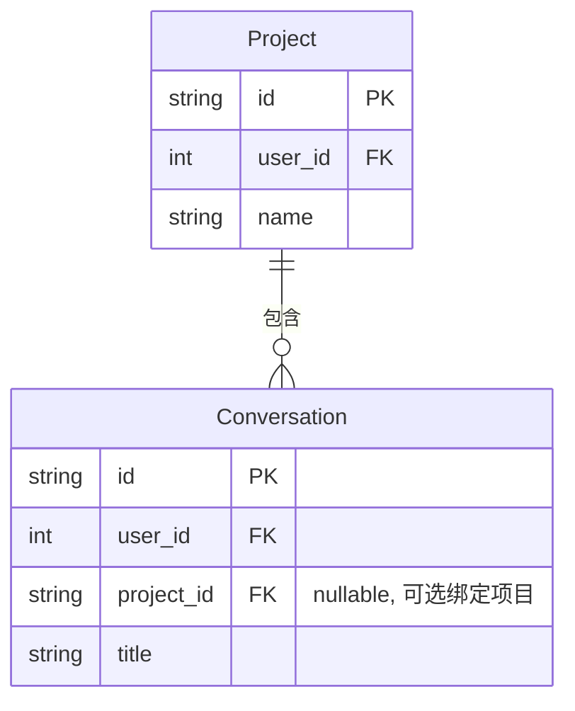

# NanoClaw 后端设计文档

## 架构概览



---

## 项目结构

```
backend/
├── __init__.py          # 应用工厂，数据库初始化
├── models.py            # SQLAlchemy 模型
├── run.py               # 入口文件
├── config.py            # 配置加载器
│
├── routes/              # API 路由
│   ├── __init__.py
│   ├── auth.py          # 认证（登录/注册/JWT）
│   ├── conversations.py # 会话 CRUD
│   ├── messages.py      # 消息 CRUD + 聊天
│   ├── models.py        # 模型列表
│   ├── projects.py      # 项目管理
│   ├── stats.py         # Token 统计
│   └── tools.py         # 工具列表
│
├── services/            # 业务逻辑
│   ├── __init__.py
│   ├── chat.py          # 聊天补全服务
│   └── glm_client.py    # GLM API 客户端
│
├── tools/               # 工具系统
│   ├── __init__.py
│   ├── core.py          # 核心类
│   ├── factory.py       # 工具装饰器
│   ├── executor.py      # 工具执行器
│   ├── services.py      # 辅助服务
│   └── builtin/         # 内置工具
│       ├── crawler.py   # 网页搜索、抓取
│       ├── data.py      # 计算器、文本、JSON
│       ├── weather.py   # 天气查询
│       ├── file_ops.py  # 文件操作（project_id 自动注入）
│       └── code.py      # 代码执行
│
├── utils/               # 辅助函数
│   ├── __init__.py
│   ├── helpers.py       # 通用函数
│   └── workspace.py     # 工作目录工具
│
└── migrations/          # 数据库迁移
    └── add_project_support.py
```

---

## 类图

### 核心数据模型



### Message Content JSON 结构

`content` 字段统一使用 JSON 格式存储：

**User 消息：**
```json
{
  "text": "用户输入的文本内容",
  "attachments": [
    {"name": "utils.py", "extension": "py", "content": "def hello()..."}
  ]
}
```

**Assistant 消息：**
```json
{
  "text": "AI 回复的文本内容",
  "thinking": "思考过程（可选）",
  "tool_calls": [
    {
      "id": "call_xxx",
      "type": "function",
      "function": {
        "name": "file_read",
        "arguments": "{\"path\": \"...\"}"
      },
      "result": "{\"content\": \"...\"}",
      "success": true,
      "skipped": false,
      "execution_time": 0.5
    }
  ]
}
```

### 服务层



### 工具系统



---

## 工作目录系统

### 概述

工作目录系统为文件操作工具提供安全隔离，确保所有文件操作都在项目目录内执行。

### 核心函数

```python
# backend/utils/workspace.py

def get_workspace_root() -> Path:
    """获取工作区根目录"""

def get_project_path(project_id: str, project_path: str) -> Path:
    """获取项目绝对路径"""

def validate_path_in_project(path: str, project_dir: Path) -> Path:
    """验证路径在项目目录内（核心安全函数）"""

def create_project_directory(name: str, user_id: int) -> tuple:
    """创建项目目录"""

def delete_project_directory(project_path: str) -> bool:
    """删除项目目录"""

def copy_folder_to_project(source_path: str, project_dir: Path, project_name: str) -> dict:
    """复制文件夹到项目目录"""
```

### 安全机制

`validate_path_in_project()` 是核心安全函数：

```python
def validate_path_in_project(path: str, project_dir: Path) -> Path:
    p = Path(path)
    
    # 相对路径转换为绝对路径
    if not p.is_absolute():
        p = project_dir / p
    
    p = p.resolve()
    
    # 安全检查：确保路径在项目目录内
    try:
        p.relative_to(project_dir.resolve())
    except ValueError:
        raise ValueError(f"Path '{path}' is outside project directory")
    
    return p
```

即使传入恶意路径，后端也会拒绝：
```python
"../../../etc/passwd"  # 尝试跳出项目目录 -> ValueError
"/etc/passwd"         # 绝对路径攻击 -> ValueError
```

### project_id 自动注入

工具执行器自动为文件工具注入 `project_id`：

```python
# backend/tools/executor.py

def process_tool_calls(self, tool_calls, context=None):
    for call in tool_calls:
        name = call["function"]["name"]
        args = json.loads(call["function"]["arguments"])
        
        # 自动注入 project_id
        if context and name.startswith("file_") and "project_id" in context:
            args["project_id"] = context["project_id"]
        
        result = self.registry.execute(name, args)
```

---

## API 总览

### 认证

| 方法 | 路径 | 说明 |
|------|------|------|
| `GET` | `/api/auth/mode` | 获取当前认证模式（公开端点） |
| `POST` | `/api/auth/login` | 用户登录，返回 JWT token |
| `POST` | `/api/auth/register` | 用户注册（仅多用户模式可用） |
| `GET` | `/api/auth/profile` | 获取当前用户信息 |
| `PATCH` | `/api/auth/profile` | 更新当前用户信息 |

### 会话管理

| 方法 | 路径 | 说明 |
|------|------|------|
| `POST` | `/api/conversations` | 创建会话（可选 `project_id` 绑定项目） |
| `GET` | `/api/conversations` | 获取会话列表（可选 `project_id` 筛选，游标分页） |
| `GET` | `/api/conversations/:id` | 获取会话详情 |
| `PATCH` | `/api/conversations/:id` | 更新会话（支持修改 `project_id`） |
| `DELETE` | `/api/conversations/:id` | 删除会话 |

### 消息管理

| 方法 | 路径 | 说明 |
|------|------|------|
| `GET` | `/api/conversations/:id/messages` | 获取消息列表（游标分页） |
| `POST` | `/api/conversations/:id/messages` | 发送消息（SSE 流式） |
| `DELETE` | `/api/conversations/:id/messages/:mid` | 删除消息 |
| `POST` | `/api/conversations/:id/regenerate/:mid` | 重新生成消息 |

### 项目管理

| 方法 | 路径 | 说明 |
|------|------|------|
| `GET` | `/api/projects` | 获取项目列表 |
| `POST` | `/api/projects` | 创建项目 |
| `GET` | `/api/projects/:id` | 获取项目详情 |
| `PUT` | `/api/projects/:id` | 更新项目 |
| `DELETE` | `/api/projects/:id` | 删除项目 |
| `POST` | `/api/projects/upload` | 上传文件夹作为项目 |
| `GET` | `/api/projects/:id/files` | 列出项目文件（支持 `?path=subdir` 子目录） |
| `GET` | `/api/projects/:id/files/:filepath` | 读取文件内容（文本文件，最大 5 MB） |
| `PUT` | `/api/projects/:id/files/:filepath` | 创建或覆盖文件（Body: `{"content": "..."}`) |
| `DELETE` | `/api/projects/:id/files/:filepath` | 删除文件或目录 |
| `POST` | `/api/projects/:id/files/mkdir` | 创建目录（Body: `{"path": "src/utils"}`) |
| `POST` | `/api/projects/:id/search` | 搜索文件内容（Body: `{"query": "...", "path": "", "max_results": 50, "case_sensitive": false}`) |

### 其他

| 方法 | 路径 | 说明 |
|------|------|------|
| `GET` | `/api/models` | 获取模型列表 |
| `GET` | `/api/tools` | 获取工具列表 |
| `GET` | `/api/stats/tokens` | Token 使用统计 |

---

## SSE 事件

| 事件 | 说明 |
|------|------|
| `thinking_start` | 新一轮思考开始，前端应清空之前的思考缓冲 |
| `thinking` | 思维链增量内容（启用时） |
| `message` | 回复内容的增量片段 |
| `tool_calls` | 工具调用信息 |
| `tool_result` | 工具执行结果 |
| `process_step` | 处理步骤（按顺序：thinking/text/tool_call/tool_result），支持穿插显示 |
| `error` | 错误信息 |
| `done` | 回复结束，携带 message_id 和 token_count |

### process_step 事件格式

```json
// 思考过程
{"index": 0, "type": "thinking", "content": "完整思考内容..."}

// 回复文本（可穿插在任意步骤之间）
{"index": 1, "type": "text", "content": "回复文本内容..."}

// 工具调用
{"index": 2, "type": "tool_call", "id": "call_abc123", "name": "web_search", "arguments": "{\"query\": \"...\"}"}

// 工具返回
{"index": 3, "type": "tool_result", "id": "call_abc123", "name": "web_search", "content": "{\"success\": true, ...}", "skipped": false}
```

字段说明：
- `index`: 步骤序号，确保按正确顺序显示
- `type`: 步骤类型（thinking/tool_call/tool_result）
- `id`: 工具调用唯一标识，用于匹配工具调用和返回结果
- `name`: 工具名称
- `content`: 内容或结果
- `skipped`: 工具是否被跳过（失败后跳过）

---

## 数据模型

### User（用户）

| 字段 | 类型 | 默认值 | 说明 |
|------|------|--------|------|
| `id` | Integer | - | 自增主键 |
| `username` | String(50) | - | 用户名（唯一） |
| `password_hash` | String(255) | null | 密码哈希（可为空，支持 API-key-only 认证） |
| `email` | String(120) | null | 邮箱（唯一） |
| `avatar` | String(512) | null | 头像 URL |
| `role` | String(20) | "user" | 角色：`user` / `admin` |
| `is_active` | Boolean | true | 是否激活 |
| `created_at` | DateTime | now | 创建时间 |
| `last_login_at` | DateTime | null | 最后登录时间 |

`password` 通过 property setter 自动调用 `werkzeug` 的 `generate_password_hash` 存储，通过 `check_password()` 方法验证。

### Project（项目）

| 字段 | 类型 | 说明 |
|------|------|------|
| `id` | String(64) | UUID 主键 |
| `user_id` | Integer | 外键关联 User |
| `name` | String(255) | 项目名称（用户内唯一） |
| `path` | String(512) | 相对路径（如 user_1/my_project） |
| `description` | Text | 项目描述 |
| `created_at` | DateTime | 创建时间 |
| `updated_at` | DateTime | 更新时间 |

### Conversation（会话）

| 字段 | 类型 | 默认值 | 说明 |
|------|------|--------|------|
| `id` | String(64) | UUID | 主键 |
| `user_id` | Integer | - | 外键关联 User |
| `project_id` | String(64) | null | 外键关联 Project（可选） |
| `title` | String(255) | "" | 会话标题 |
| `model` | String(64) | "glm-5" | 模型名称 |
| `system_prompt` | Text | "" | 系统提示词 |
| `temperature` | Float | 1.0 | 采样温度 |
| `max_tokens` | Integer | 65536 | 最大输出 token |
| `thinking_enabled` | Boolean | False | 是否启用思维链 |
| `created_at` | DateTime | now | 创建时间 |
| `updated_at` | DateTime | now | 更新时间 |

### Message（消息）

| 字段 | 类型 | 说明 |
|------|------|------|
| `id` | String(64) | UUID 主键 |
| `conversation_id` | String(64) | 外键关联 Conversation |
| `role` | String(16) | user/assistant/system/tool |
| `content` | LongText | JSON 格式内容（见上方结构说明） |
| `token_count` | Integer | Token 数量 |
| `created_at` | DateTime | 创建时间 |

### TokenUsage（Token 使用统计）

| 字段 | 类型 | 说明 |
|------|------|------|
| `id` | Integer | 自增主键 |
| `user_id` | Integer | 外键关联 User |
| `date` | Date | 统计日期 |
| `model` | String(64) | 模型名称 |
| `prompt_tokens` | Integer | 输入 token |
| `completion_tokens` | Integer | 输出 token |
| `total_tokens` | Integer | 总 token |
| `created_at` | DateTime | 创建时间 |

---

## 分页机制

所有列表接口使用**游标分页**：

```
GET /api/conversations?limit=20&cursor=conv_abc123
```

响应：
```json
{
  "code": 0,
  "data": {
    "items": [...],
    "next_cursor": "conv_def456",
    "has_more": true
  }
}
```

- `limit`：每页数量（会话默认 20，消息默认 50，最大 100）
- `cursor`：上一页最后一条的 ID

---

## 认证机制

### 概述

系统支持**单用户模式**和**多用户模式**，通过 `config.yml` 中的 `auth_mode` 切换。

### 单用户模式（`auth_mode: single`，默认）

- **无需登录**，前端不需要传 token
- 后端自动创建一个 `username="default"`、`role="admin"` 的用户
- 每次请求通过 `before_request` 钩子自动将 `g.current_user` 设为该默认用户
- 所有路由从 `g.current_user` 获取当前用户，无需前端传递 `user_id`

### 多用户模式（`auth_mode: multi`）

- 除公开端点外，所有请求必须在 `Authorization` 头中携带 JWT token
- 用户通过 `/api/auth/register` 注册、`/api/auth/login` 登录获取 token
- Token 有效期 7 天，过期需重新登录
- 用户只能访问自己的数据（对话、项目、统计等）

### 认证流程

```
单用户模式：
  请求 → before_request → 查找/创建 default 用户 → g.current_user → 路由处理

多用户模式：
  请求 → before_request → 提取 Authorization header → 验证 JWT → 查找用户 → g.current_user → 路由处理
                                                                    ↓ 失败
                                                                返回 401
```

### 公开端点（无需认证）

| 端点 | 说明 |
|------|------|
| `POST /api/auth/login` | 登录 |
| `POST /api/auth/register` | 注册 |
| `GET /api/models` | 模型列表 |
| `GET /api/tools` | 工具列表 |

### 前端适配

前端 API 层（`frontend/src/api/index.js`）已预留 token 管理：
- `getToken()` / `setToken(token)` / `clearToken()`
- 所有请求自动附带 `Authorization: Bearer <token>`（token 为空时不发送）
- 收到 401 时自动清除 token

切换到多用户模式时，只需补充登录/注册页面 UI。

---

| Code | 说明 |
|------|------|
| `0` | 成功 |
| `400` | 请求参数错误 |
| `401` | 未认证（多用户模式下缺少或无效 token） |
| `403` | 禁止访问（账户禁用、单用户模式下注册等） |
| `404` | 资源不存在 |
| `409` | 资源冲突（用户名/邮箱已存在） |
| `500` | 服务器错误 |

错误响应：
```json
{
  "code": 404,
  "message": "conversation not found"
}
```

---

## 项目-对话关联机制

### 设计目标

将项目（Project）和对话（Conversation）建立**持久绑定关系**，实现：
1. 创建对话时自动绑定当前选中的项目
2. 对话列表支持按项目筛选/分组
3. 工具执行自动使用对话所属项目的上下文，无需 AI 每次询问 `project_id`
4. 支持对话在项目间迁移

### 数据模型（已存在）



`Conversation.project_id` 是 nullable 的外键：
- `null` = 未绑定项目（通用对话，文件工具不可用）
- 非 null = 绑定到特定项目（工具自动使用该项目的工作空间）

### API 设计

#### 创建对话 `POST /api/conversations`

```json
// Request
{
  "title": "新对话",
  "project_id": "uuid-of-project"  // 可选，传入则绑定项目
}

// Response
{
  "code": 0,
  "data": {
    "id": "conv-uuid",
    "project_id": "uuid-of-project",  // 回显绑定
    "project_name": "AlgoLab",         // 附带项目名称，方便前端显示
    "title": "新对话",
    ...
  }
}
```

#### 对话列表 `GET /api/conversations`

支持按项目筛选：

```
GET /api/conversations?project_id=xxx    # 仅返回该项目的对话
GET /api/conversations                    # 返回所有对话（当前行为）
```

响应中附带项目信息：

```json
{
  "code": 0,
  "data": {
    "items": [
      {
        "id": "conv-1",
        "project_id": "proj-1",
        "project_name": "AlgoLab",
        "title": "分析数据",
        ...
      },
      {
        "id": "conv-2",
        "project_id": null,
        "project_name": null,
        "title": "闲聊",
        ...
      }
    ]
  }
}
```

#### 更新对话 `PATCH /api/conversations/:id`

支持修改 `project_id`（迁移对话到其他项目）：

```json
{
  "project_id": "new-project-uuid"  // 设为 null 可解绑
}
```

#### 发送消息 `POST /api/conversations/:id/messages`

`project_id` 优先级：
1. 请求体中的 `project_id`（前端显式传递）
2. `conversation.project_id`（对话绑定的项目，自动回退）
3. `null`（无项目上下文，文件工具报错提示）

```python
# 伪代码
effective_project_id = request_project_id or conv.project_id
context = {"project_id": effective_project_id} if effective_project_id else None
```

这样 AI **不需要**知道 `project_id`，后端会自动注入。建议将 `project_id` 从文件工具的 `required` 参数列表中移除，改为后端自动注入。

### 工具上下文自动注入（已实施）

`project_id` 已从所有文件工具的 `required` 参数列表中移除，改为后端自动注入。

**实施细节：**

1. **工具 Schema**：`file_*` 工具不再声明 `project_id` 参数，AI 不会看到也不会询问
2. **自动注入**：`ToolExecutor` 在执行文件工具时自动从 context 注入 `project_id`
3. **Context 构建**：`ChatService` 根据请求或对话绑定自动构建 `context = {"project_id": ...}`

```python
# 工具定义 - 不再声明 project_id
parameters = {
    "properties": {
        "path": {"type": "string", "description": "文件路径"},
        "pattern": {"type": "string", "description": "过滤模式", "default": "*"}
    },
    "required": []  # 所有参数有默认值，project_id 完全透明
}

# ToolExecutor 自动注入（已有逻辑）
if name.startswith("file_") and context and "project_id" in context:
    args["project_id"] = context["project_id"]
```

### UI 交互设计

#### 侧边栏布局

```
┌─────────────────────┐
│ [📁 AlgoLab    ▼]   │  ← 项目选择器
├─────────────────────┤
│ [+ 新对话]           │
├─────────────────────┤
│  📎 分析数据   3条   │  ← 属于当前项目的对话
│  📎 优化算法   5条   │
│  📎 调试测试   2条   │
├─────────────────────┤
│ 选择其他项目查看对话  │  ← 或切换项目
└─────────────────────┘
```

**交互规则：**
1. 顶部项目选择器决定**当前工作空间**
2. 选中项目后，对话列表**仅显示该项目的对话**
3. 创建新对话时**自动绑定**当前项目
4. 未选中项目时显示全部对话
5. 切换项目不切换当前对话（保持对话焦点）

#### 对话项显示

- 对话标题前显示小圆点颜色，区分所属项目（可选）
- 悬浮/详情中显示所属项目名称

---

## 配置文件

配置文件：`config.yml`

```yaml
# 服务端口
backend_port: 3000
frontend_port: 4000

# LLM API（全局默认值，每个 model 可单独覆盖）
default_api_key: your-api-key
default_api_url: https://open.bigmodel.cn/api/paas/v4/chat/completions

# 可用模型列表
models:
  - id: glm-5
    name: GLM-5
    # api_key: ...      # 可选，不指定则用 default_api_key
    # api_url: ...      # 可选，不指定则用 default_api_url
  - id: glm-5-turbo
    name: GLM-5 Turbo
    api_key: another-key       # 该模型使用独立凭证
    api_url: https://other.api.com/chat/completions

# 默认模型
default_model: glm-5

# 工作区根目录
workspace_root: ./workspaces

# 认证模式：single（单用户，无需登录） / multi（多用户，需要 JWT）
auth_mode: single
# JWT 密钥（仅多用户模式使用，生产环境请替换为随机值）
jwt_secret: nano-claw-default-secret-change-in-production

# 数据库
db_type: mysql  # mysql, sqlite, postgresql
db_host: localhost
db_port: 3306
db_user: root
db_password: ""
db_name: nano_claw
db_sqlite_file: app.db  # SQLite 时使用
```