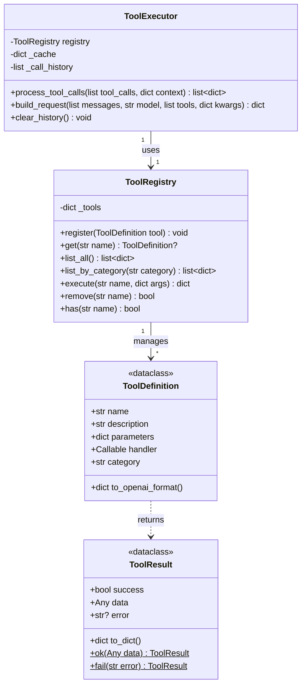
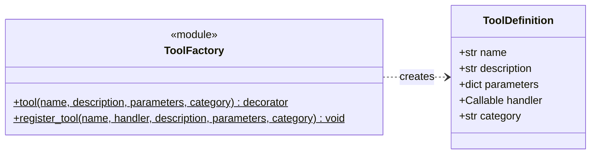

# 工具调用系统设计

## 概述

NanoClaw 工具调用系统采用简化的工厂模式，支持装饰器注册、缓存优化、重复调用检测等功能。

---

## 一、核心类图



---

## 二、工具定义工厂

使用工厂函数创建工具，避免复杂的类继承：



---

## 三、核心类实现

### 3.1 ToolDefinition

```python
from dataclasses import dataclass, field
from typing import Callable, Any

@dataclass
class ToolDefinition:
    """工具定义"""
    name: str
    description: str
    parameters: dict  # JSON Schema
    handler: Callable[[dict], Any]
    category: str = "general"

    def to_openai_format(self) -> dict:
        return {
            "type": "function",
            "function": {
                "name": self.name,
                "description": self.description,
                "parameters": self.parameters
            }
        }
```

### 3.2 ToolResult

```python
from dataclasses import dataclass
from typing import Any, Optional

@dataclass
class ToolResult:
    """工具执行结果"""
    success: bool
    data: Any = None
    error: Optional[str] = None

    def to_dict(self) -> dict:
        return {
            "success": self.success,
            "data": self.data,
            "error": self.error
        }

    @classmethod
    def ok(cls, data: Any) -> "ToolResult":
        return cls(success=True, data=data)

    @classmethod
    def fail(cls, error: str) -> "ToolResult":
        return cls(success=False, error=error)
```

### 3.3 ToolRegistry

```python
from typing import Dict, List, Optional

class ToolRegistry:
    """工具注册表（单例）"""
    _instance = None

    def __new__(cls):
        if cls._instance is None:
            cls._instance = super().__new__(cls)
            cls._instance._tools: Dict[str, ToolDefinition] = {}
        return cls._instance

    def register(self, tool: ToolDefinition) -> None:
        """注册工具"""
        self._tools[tool.name] = tool

    def get(self, name: str) -> Optional[ToolDefinition]:
        """获取工具定义"""
        return self._tools.get(name)

    def list_all(self) -> List[dict]:
        """列出所有工具（OpenAI 格式）"""
        return [t.to_openai_format() for t in self._tools.values()]

    def list_by_category(self, category: str) -> List[dict]:
        """按类别列出工具"""
        return [
            t.to_openai_format()
            for t in self._tools.values()
            if t.category == category
        ]

    def execute(self, name: str, arguments: dict) -> dict:
        """执行工具"""
        tool = self.get(name)
        if not tool:
            return ToolResult.fail(f"Tool not found: {name}").to_dict()

        try:
            result = tool.handler(arguments)
            if isinstance(result, ToolResult):
                return result.to_dict()
            return ToolResult.ok(result).to_dict()
        except Exception as e:
            return ToolResult.fail(str(e)).to_dict()

    def remove(self, name: str) -> bool:
        """移除工具"""
        if name in self._tools:
            del self._tools[name]
            return True
        return False

    def has(self, name: str) -> bool:
        """检查工具是否存在"""
        return name in self._tools


# 全局注册表
registry = ToolRegistry()
```

### 3.4 ToolExecutor

```python
import json
import time
import hashlib
from typing import List, Dict, Optional

class ToolExecutor:
    """工具执行器（支持缓存和重复检测）"""

    def __init__(
        self,
        registry: ToolRegistry = None,
        api_url: str = None,
        api_key: str = None,
        enable_cache: bool = True,
        cache_ttl: int = 300,  # 5分钟
    ):
        self.registry = registry or ToolRegistry()
        self.api_url = api_url
        self.api_key = api_key
        self.enable_cache = enable_cache
        self.cache_ttl = cache_ttl
        self._cache: Dict[str, tuple] = {}  # key -> (result, timestamp)
        self._call_history: List[dict] = []  # 当前会话的调用历史

    def _execute_with_retry(self, name: str, arguments: dict) -> dict:
        """
        执行工具，不自动重试。
        成功或失败都直接返回结果，由模型决定下一步操作。
        """
        result = self.registry.execute(name, arguments)
        return result

    def _make_cache_key(self, name: str, args: dict) -> str:
        """生成缓存键"""
        args_str = json.dumps(args, sort_keys=True, ensure_ascii=False)
        return hashlib.md5(f"{name}:{args_str}".encode()).hexdigest()

    def _get_cached(self, key: str) -> Optional[dict]:
        """获取缓存结果"""
        if not self.enable_cache:
            return None
        if key in self._cache:
            result, timestamp = self._cache[key]
            if time.time() - timestamp < self.cache_ttl:
                return result
            del self._cache[key]
        return None

    def _set_cache(self, key: str, result: dict) -> None:
        """设置缓存"""
        if self.enable_cache:
            self._cache[key] = (result, time.time())

    def _check_duplicate_in_history(self, name: str, args: dict) -> Optional[dict]:
        """检查历史中是否有相同调用"""
        args_str = json.dumps(args, sort_keys=True, ensure_ascii=False)
        for record in self._call_history:
            if record["name"] == name and record["args_str"] == args_str:
                return record["result"]
        return None

    def clear_history(self) -> None:
        """清空调用历史（新会话开始时调用）"""
        self._call_history.clear()

    def process_tool_calls(
        self,
        tool_calls: List[dict],
        context: dict = None
    ) -> List[dict]:
        """
        处理工具调用，返回消息列表

        Args:
            tool_calls: LLM 返回的工具调用列表
            context: 可选上下文信息（user_id 等）

        Returns:
            工具响应消息列表，可直接追加到 messages
        """
        results = []
        seen_calls = set()  # 当前批次内的重复检测

        for call in tool_calls:
            name = call["function"]["name"]
            args_str = call["function"]["arguments"]
            call_id = call["id"]

            try:
                args = json.loads(args_str) if isinstance(args_str, str) else args_str
            except json.JSONDecodeError:
                results.append(self._create_error_result(
                    call_id, name, "Invalid JSON arguments"
                ))
                continue

            # 检查批次内重复
            call_key = f"{name}:{json.dumps(args, sort_keys=True)}"
            if call_key in seen_calls:
                results.append(self._create_tool_result(
                    call_id, name,
                    {"success": True, "data": None, "cached": True, "duplicate": True}
                ))
                continue
            seen_calls.add(call_key)

            # 检查历史重复
            history_result = self._check_duplicate_in_history(name, args)
            if history_result is not None:
                result = {**history_result, "cached": True}
                results.append(self._create_tool_result(call_id, name, result))
                continue

            # 检查缓存
            cache_key = self._make_cache_key(name, args)
            cached_result = self._get_cached(cache_key)
            if cached_result is not None:
                result = {**cached_result, "cached": True}
                results.append(self._create_tool_result(call_id, name, result))
                continue

            # 执行工具
            result = self.registry.execute(name, args)

            # 缓存结果
            self._set_cache(cache_key, result)

            # 添加到历史
            self._call_history.append({
                "name": name,
                "args_str": json.dumps(args, sort_keys=True, ensure_ascii=False),
                "result": result
            })

            results.append(self._create_tool_result(call_id, name, result))

        return results

    def _create_tool_result(
        self,
        call_id: str,
        name: str,
        result: dict,
        execution_time: float = 0
    ) -> dict:
        """创建工具结果消息"""
        result["execution_time"] = execution_time
        return {
            "role": "tool",
            "tool_call_id": call_id,
            "name": name,
            "content": json.dumps(result, ensure_ascii=False, default=str)
        }

    def _create_error_result(
        self,
        call_id: str,
        name: str,
        error: str
    ) -> dict:
        """创建错误结果消息"""
        return {
            "role": "tool",
            "tool_call_id": call_id,
            "name": name,
            "content": json.dumps({
                "success": False,
                "error": error
            }, ensure_ascii=False)
        }

    def build_request(
        self,
        messages: List[dict],
        model: str = "glm-5",
        tools: List[dict] = None,
        **kwargs
    ) -> dict:
        """构建 API 请求体"""
        return {
            "model": model,
            "messages": messages,
            "tools": tools or self.registry.list_all(),
            "tool_choice": kwargs.get("tool_choice", "auto"),
            **{k: v for k, v in kwargs.items() if k not in ["tool_choice"]}
        }
```

---

## 四、工具工厂模式

### 4.1 装饰器注册

```python
# backend/tools/factory.py

from typing import Callable
from backend.tools.core import ToolDefinition, registry


def tool(
    name: str,
    description: str,
    parameters: dict,
    category: str = "general"
) -> Callable:
    """
    工具注册装饰器

    用法:
        @tool(
            name="web_search",
            description="搜索互联网获取信息",
            parameters={"type": "object", "properties": {...}},
            category="crawler"
        )
        def web_search(arguments: dict) -> dict:
            ...
    """
    def decorator(func: Callable) -> Callable:
        tool_def = ToolDefinition(
            name=name,
            description=description,
            parameters=parameters,
            handler=func,
            category=category
        )
        registry.register(tool_def)
        return func
    return decorator


def register_tool(
    name: str,
    handler: Callable,
    description: str,
    parameters: dict,
    category: str = "general"
) -> None:
    """
    直接注册工具（无需装饰器）

    用法:
        register_tool(
            name="my_tool",
            handler=my_function,
            description="工具描述",
            parameters={...}
        )
    """
    tool_def = ToolDefinition(
        name=name,
        description=description,
        parameters=parameters,
        handler=handler,
        category=category
    )
    registry.register(tool_def)
```

### 4.2 使用示例

```python
# backend/tools/builtin/crawler.py

from backend.tools.factory import tool
from backend.tools.services import SearchService, FetchService

# 网页搜索工具
@tool(
    name="web_search",
    description="Search the internet for information. Use when you need to find latest news or answer questions that require web search.",
    parameters={
        "type": "object",
        "properties": {
            "query": {
                "type": "string",
                "description": "Search keywords"
            },
            "max_results": {
                "type": "integer",
                "description": "Number of results to return, default 5",
                "default": 5
            }
        },
        "required": ["query"]
    },
    category="crawler"
)
def web_search(arguments: dict) -> dict:
    """Web search tool"""
    query = arguments["query"]
    max_results = arguments.get("max_results", 5)
    service = SearchService()
    results = service.search(query, max_results)
    return {"results": results}


# 页面抓取工具
@tool(
    name="fetch_page",
    description="Fetch content from a specific webpage. Use when user needs detailed information from a webpage.",
    parameters={
        "type": "object",
        "properties": {
            "url": {
                "type": "string",
                "description": "URL of the webpage to fetch"
            },
            "extract_type": {
                "type": "string",
                "description": "Extraction type",
                "enum": ["text", "links", "structured"],
                "default": "text"
            }
        },
        "required": ["url"]
    },
    category="crawler"
)
def fetch_page(arguments: dict) -> dict:
    """Page fetch tool"""
    url = arguments["url"]
    extract_type = arguments.get("extract_type", "text")
    service = FetchService()
    result = service.fetch(url, extract_type)
    return result


# 批量抓取工具
@tool(
    name="crawl_batch",
    description="Batch fetch multiple webpages. Use when you need to get content from multiple pages at once.",
    parameters={
        "type": "object",
        "properties": {
            "urls": {
                "type": "array",
                "items": {"type": "string"},
                "description": "List of URLs to fetch"
            },
            "extract_type": {
                "type": "string",
                "enum": ["text", "links", "structured"],
                "default": "text"
            }
        },
        "required": ["urls"]
    },
    category="crawler"
)
def crawl_batch(arguments: dict) -> dict:
    """Batch fetch tool"""
    urls = arguments["urls"]
    extract_type = arguments.get("extract_type", "text")

    if len(urls) > 10:
        return {"error": "Maximum 10 pages can be fetched at once"}

    service = FetchService()
    results = service.fetch_batch(urls, extract_type)
    return {"results": results, "total": len(results)}
```

---

## 五、辅助服务类

工具依赖的服务保持独立，不与工具类耦合：

```python
# backend/tools/services.py

from typing import List, Dict
from ddgs import DDGS
import re


class SearchService:
    """搜索服务"""

    def __init__(self, engine: str = "duckduckgo"):
        self.engine = engine

    def search(
        self,
        query: str,
        max_results: int = 5,
        region: str = "cn-zh"
    ) -> List[dict]:
        """执行搜索"""
        if self.engine == "duckduckgo":
            return self._search_duckduckgo(query, max_results, region)
        else:
            raise ValueError(f"Unsupported search engine: {self.engine}")

    def _search_duckduckgo(
        self,
        query: str,
        max_results: int,
        region: str
    ) -> List[dict]:
        """DuckDuckGo 搜索"""
        with DDGS() as ddgs:
            results = list(ddgs.text(
                query,
                max_results=max_results,
                region=region
            ))

        return [
            {
                "title": r.get("title", ""),
                "url": r.get("href", ""),
                "snippet": r.get("body", "")
            }
            for r in results
        ]


class FetchService:
    """页面抓取服务"""

    def __init__(self, timeout: float = 30.0, user_agent: str = None):
        self.timeout = timeout
        self.user_agent = user_agent or (
            "Mozilla/5.0 (Windows NT 10.0; Win64; x64) "
            "AppleWebKit/537.36 (KHTML, like Gecko) "
            "Chrome/120.0.0.0 Safari/537.36"
        )

    def fetch(self, url: str, extract_type: str = "text") -> dict:
        """抓取单个页面"""
        import httpx

        try:
            resp = httpx.get(
                url,
                timeout=self.timeout,
                follow_redirects=True,
                headers={"User-Agent": self.user_agent}
            )
            resp.raise_for_status()
        except Exception as e:
            return {"error": str(e), "url": url}

        html = resp.text
        extractor = ContentExtractor(html)

        if extract_type == "text":
            return {
                "url": url,
                "text": extractor.extract_text()
            }
        elif extract_type == "links":
            return {
                "url": url,
                "links": extractor.extract_links()
            }
        else:
            return extractor.extract_structured(url)

    def fetch_batch(
        self,
        urls: List[str],
        extract_type: str = "text",
        max_concurrent: int = 5
    ) -> List[dict]:
        """批量抓取页面"""
        results = []
        for url in urls:
            results.append(self.fetch(url, extract_type))
        return results


class ContentExtractor:
    """内容提取器"""

    def __init__(self, html: str):
        self.html = html
        self._soup = None

    @property
    def soup(self):
        if self._soup is None:
            try:
                from bs4 import BeautifulSoup
                self._soup = BeautifulSoup(self.html, "html.parser")
            except ImportError:
                raise ImportError("Please install beautifulsoup4: pip install beautifulsoup4")
        return self._soup

    def extract_text(self) -> str:
        """提取纯文本"""
        # 移除脚本和样式
        for tag in self.soup(["script", "style", "nav", "footer", "header"]):
            tag.decompose()

        text = self.soup.get_text(separator="\n", strip=True)
        # 清理多余空白
        text = re.sub(r"\n{3,}", "\n\n", text)
        return text

    def extract_links(self) -> List[dict]:
        """提取链接"""
        links = []
        for a in self.soup.find_all("a", href=True):
            text = a.get_text(strip=True)
            href = a["href"]
            if text and href and not href.startswith(("#", "javascript:")):
                links.append({"text": text, "href": href})
        return links[:50]  # 限制数量

    def extract_structured(self, url: str = "") -> dict:
        """提取结构化内容"""
        soup = self.soup

        # 提取标题
        title = ""
        if soup.title:
            title = soup.title.string or ""

        # 提取 meta 描述
        description = ""
        meta_desc = soup.find("meta", attrs={"name": "description"})
        if meta_desc:
            description = meta_desc.get("content", "")

        return {
            "url": url,
            "title": title.strip(),
            "description": description.strip(),
            "text": self.extract_text()[:5000],  # 限制长度
            "links": self.extract_links()[:20]
        }


class CalculatorService:
    """安全计算服务"""

    ALLOWED_OPS = {
        "add", "sub", "mul", "truediv", "floordiv",
        "mod", "pow", "neg", "abs"
    }

    def evaluate(self, expression: str) -> dict:
        """安全计算数学表达式"""
        import ast
        import operator

        ops = {
            ast.Add: operator.add,
            ast.Sub: operator.sub,
            ast.Mult: operator.mul,
            ast.Div: operator.truediv,
            ast.FloorDiv: operator.floordiv,
            ast.Mod: operator.mod,
            ast.Pow: operator.pow,
            ast.USub: operator.neg,
            ast.UAdd: operator.pos,
        }

        try:
            # 解析表达式
            node = ast.parse(expression, mode="eval")

            # 验证节点类型
            for child in ast.walk(node):
                if isinstance(child, ast.Call):
                    return {"error": "Function calls not allowed"}
                if isinstance(child, ast.Name):
                    return {"error": "Variable names not allowed"}

            # 安全执行
            result = eval(
                compile(node, "<string>", "eval"),
                {"__builtins__": {}},
                {}
            )

            return {"result": result}

        except Exception as e:
            return {"error": f"Calculation error: {str(e)}"}
```

---

## 六、工具初始化

```python
# backend/tools/__init__.py

"""
NanoClaw Tool System

Usage:
    from backend.tools import registry, ToolExecutor, tool
    from backend.tools import init_tools

    # 初始化内置工具
    init_tools()

    # 列出所有工具
    tools = registry.list_all()

    # 执行工具
    result = registry.execute("web_search", {"query": "Python"})
"""

from backend.tools.core import ToolDefinition, ToolResult, ToolRegistry, registry
from backend.tools.factory import tool, register_tool
from backend.tools.executor import ToolExecutor


def init_tools() -> None:
    """
    初始化所有内置工具

    导入 builtin 模块会自动注册所有装饰器定义的工具
    """
    from backend.tools.builtin import crawler, data, weather, file_ops  # noqa: F401


# 公开 API 导出
__all__ = [
    # 核心类
    "ToolDefinition",
    "ToolResult",
    "ToolRegistry",
    "ToolExecutor",
    # 实例
    "registry",
    # 工厂函数
    "tool",
    "register_tool",
    # 初始化
    "init_tools",
]
```

---

## 七、工具清单

### 7.1 爬虫工具 (crawler)

| 工具名称          | 描述                          | 参数                                      |
| --------------- | --------------------------- | --------------------------------------- |
| `web_search`    | 搜索互联网获取信息                   | `query`: 搜索关键词<br>`max_results`: 结果数量（默认 5） |
| `fetch_page`    | 抓取单个网页内容                    | `url`: 网页 URL<br>`extract_type`: 提取类型（text/links/structured） |
| `crawl_batch`   | 批量抓取多个网页（最多 10 个）           | `urls`: URL 列表<br>`extract_type`: 提取类型 |

### 7.2 数据处理工具 (data)

| 工具名称          | 描述                          | 参数                                      |
| --------------- | --------------------------- | --------------------------------------- |
| `calculator`    | 执行数学计算（支持加减乘除、幂、模等）         | `expression`: 数学表达式                     |
| `text_process`  | 文本处理（计数、格式转换等）              | `text`: 文本内容<br>`operation`: 操作类型（count/lines/words/upper/lower/reverse） |
| `json_process`  | JSON 处理（解析、格式化、提取、验证）       | `json_string`: JSON 字符串<br>`operation`: 操作类型（parse/format/keys/validate） |

### 7.3 天气工具 (weather)

| 工具名称          | 描述                          | 参数                                      |
| --------------- | --------------------------- | --------------------------------------- |
| `get_weather`   | 查询指定城市的天气信息（模拟数据）           | `city`: 城市名称（如：北京、上海、广州）                |

### 7.4 文件操作工具 (file)

| 工具名称          | 描述                          | 参数                                      |
| --------------- | --------------------------- | --------------------------------------- |
| `file_read`     | 读取文件内容                      | `path`: 文件路径<br>`encoding`: 编码（默认 utf-8） |
| `file_write`    | 写入文件（支持覆盖和追加）               | `path`: 文件路径<br>`content`: 内容<br>`mode`: 写入模式（write/append） |
| `file_delete`   | 删除文件                        | `path`: 文件路径                            |
| `file_list`     | 列出目录内容                      | `path`: 目录路径（默认 .）<br>`pattern`: 文件模式（默认 *） |
| `file_exists`   | 检查文件或目录是否存在                 | `path`: 路径                              |
| `file_mkdir`    | 创建目录（自动创建父目录）               | `path`: 目录路径                            |

**安全说明**：文件操作工具限制在项目根目录内，防止越权访问。

---

## 八、与旧设计对比

| 方面      | 旧设计               | 新设计              |
| --------- | ----------------- | ----------------- |
| 类数量    | 30+               | ~10               |
| 工具定义  | 继承 BaseTool       | 装饰器 + 函数         |
| 中间抽象层 | 5个（CrawlerTool 等） | 无                 |
| 扩展方式  | 创建子类              | 写函数 + 装饰器         |
| 缓存机制  | 无                 | 支持结果缓存（TTL 可配置）   |
| 重复检测  | 无                 | 支持会话内重复调用检测       |
| 代码量    | 多                 | 少                 |

---

## 九、核心特性

### 9.1 装饰器注册

简化工具定义，只需一个装饰器：

```python
@tool(
    name="my_tool",
    description="工具描述",
    parameters={...},
    category="custom"
)
def my_tool(arguments: dict) -> dict:
    # 工具实现
    return {"result": "ok"}
```

### 9.2 智能缓存

- **结果缓存**：相同参数的工具调用结果会被缓存（默认 5 分钟）
- **可配置 TTL**：通过 `cache_ttl` 参数设置缓存过期时间
- **可禁用**：通过 `enable_cache=False` 关闭缓存

### 9.3 重复检测

- **批次内去重**：同一批次中相同工具+参数的调用会被跳过
- **历史去重**：同一会话内已调用过的工具会直接返回缓存结果
- **自动清理**：新会话开始时调用 `clear_history()` 清理历史

### 9.4 无自动重试

- **直接返回结果**：工具执行成功或失败都直接返回，不自动重试
- **模型决策**：失败时返回错误信息，由模型决定是否重试或尝试其他工具
- **灵活性**：模型可以根据错误类型选择不同的解决策略

### 9.5 安全设计

- **计算器安全**：禁止函数调用和变量名，只支持数学运算
- **文件沙箱**：文件操作限制在项目根目录内，防止越权访问
- **错误处理**：所有工具执行都有 try-catch，不会因工具错误导致系统崩溃

---

## 十、总结

简化后的设计特点：

1. **核心类**：`ToolDefinition`、`ToolRegistry`、`ToolExecutor`、`ToolResult`
2. **工厂模式**：使用 `@tool` 装饰器注册工具
3. **服务分离**：工具依赖的服务独立，不与工具类耦合
4. **性能优化**：支持缓存和重复检测，减少重复计算和网络请求
5. **智能决策**：工具执行失败时不自动重试，由模型决定下一步操作
6. **易于扩展**：新增工具只需写一个函数并加装饰器
7. **安全可靠**：文件沙箱、安全计算、完善的错误处理
