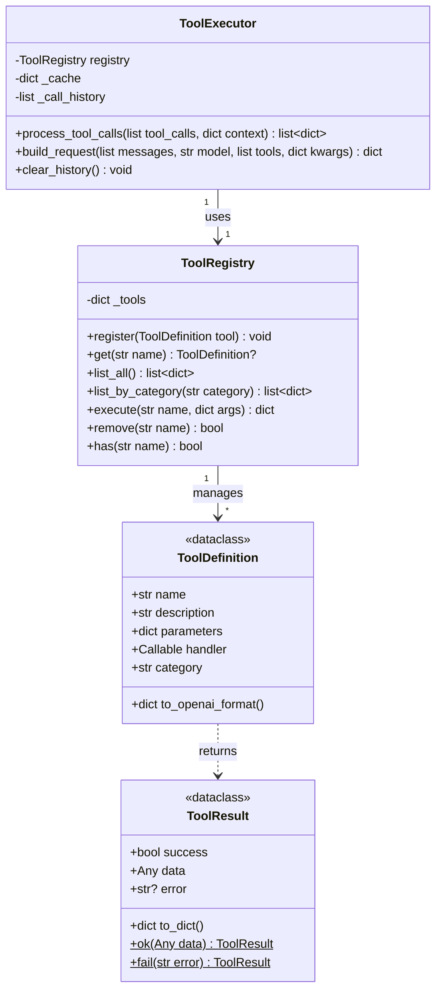

# 工具调用系统设计

## 概述

NanoClaw 工具调用系统采用简化的工厂模式，支持装饰器注册、缓存优化、重复调用检测、工作目录隔离等功能。

---

## 一、核心类图



---

## 二、工具调用格式

### 统一格式

存储和流式传输使用统一格式：

```json
{
  "id": "call_xxx",
  "type": "function",
  "function": {
    "name": "web_search",
    "arguments": "{\"query\": \"...\"}"
  },
  "result": "{\"success\": true, ...}",
  "success": true,
  "skipped": false,
  "execution_time": 0
}
```

前端使用 `call.function.name` 获取工具名称。

---

## 三、上下文注入

### context 参数

`process_tool_calls()` 接受 `context` 参数，用于自动注入工具参数：

```python
# backend/tools/executor.py

def process_tool_calls(
    self,
    tool_calls: List[dict],
    context: Optional[dict] = None
) -> List[dict]:
    """
    Args:
        tool_calls: LLM 返回的工具调用列表
        context: 上下文信息，支持：
            - project_id: 自动注入到文件工具
    """
    for call in tool_calls:
        name = call["function"]["name"]
        args = json.loads(call["function"]["arguments"])
        
        # 自动注入 project_id 到文件工具
        if context:
            if name.startswith("file_") and "project_id" in context:
                args["project_id"] = context["project_id"]
        
        result = self.registry.execute(name, args)
```

### 使用示例

```python
# backend/services/chat.py

def stream_response(self, conv, tools_enabled=True, project_id=None):
    # 构建上下文
    context = {"project_id": project_id} if project_id else None
    
    # 处理工具调用时自动注入
    tool_results = self.executor.process_tool_calls(tool_calls, context)
```

---

## 四、文件工具安全设计

### project_id 必需

所有文件工具都需要 `project_id` 参数：

```python
@tool(
    name="file_read",
    description="Read content from a file within the project workspace.",
    parameters={
        "type": "object",
        "properties": {
            "path": {"type": "string", "description": "File path"},
            "project_id": {"type": "string", "description": "Project ID (required)"},
            "encoding": {"type": "string", "default": "utf-8"}
        },
        "required": ["path", "project_id"]
    },
    category="file"
)
def file_read(arguments: dict) -> dict:
    path, project_dir = _resolve_path(
        arguments["path"], 
        arguments.get("project_id")
    )
    # ...
```

### 路径验证

`_resolve_path()` 函数强制验证路径在项目内：

```python
def _resolve_path(path: str, project_id: str = None) -> Tuple[Path, Path]:
    if not project_id:
        raise ValueError("project_id is required for file operations")
    
    project = db.session.get(Project, project_id)
    if not project:
        raise ValueError(f"Project not found: {project_id}")
    
    project_dir = get_project_path(project.id, project.path)
    
    # 核心安全验证
    return validate_path_in_project(path, project_dir), project_dir
```

### 安全隔离示例

```python
# 即使模型尝试访问敏感文件
file_read({"path": "../../../etc/passwd", "project_id": "xxx"})
# -> ValueError: Path is outside project directory

file_read({"path": "/etc/passwd", "project_id": "xxx"})
# -> ValueError: Path is outside project directory

# 只有项目内路径才被允许
file_read({"path": "src/main.py", "project_id": "xxx"})
# -> 成功读取
```

---

## 五、工具清单

### 5.1 爬虫工具 (crawler)

| 工具名称 | 描述 | 参数 |
|---------|------|------|
| `web_search` | 搜索互联网获取信息 | `query`: 搜索关键词<br>`max_results`: 结果数量（默认 5） |
| `fetch_page` | 抓取单个网页内容 | `url`: 网页 URL<br>`extract_type`: 提取类型（text/links/structured） |
| `crawl_batch` | 批量抓取多个网页（最多 10 个） | `urls`: URL 列表<br>`extract_type`: 提取类型 |

### 5.2 数据处理工具 (data)

| 工具名称 | 描述 | 参数 |
|---------|------|------|
| `calculator` | 执行数学计算 | `expression`: 数学表达式 |
| `text_process` | 文本处理 | `text`: 文本内容<br>`operation`: 操作类型 |
| `json_process` | JSON 处理 | `json_string`: JSON 字符串<br>`operation`: 操作类型 |

### 5.3 代码执行 (code)

| 工具名称 | 描述 | 参数 |
|---------|------|------|
| `execute_python` | 在沙箱环境中执行 Python 代码 | `code`: Python 代码 |

安全措施：
- 白名单模块限制
- 危险内置函数禁止
- 10 秒超时限制
- 无文件系统访问
- 无网络访问

### 5.4 文件操作工具 (file)

**所有文件工具需要 `project_id` 参数**

| 工具名称 | 描述 | 参数 |
|---------|------|------|
| `file_read` | 读取文件内容 | `path`, `project_id`, `encoding` |
| `file_write` | 写入文件 | `path`, `content`, `project_id`, `mode` |
| `file_delete` | 删除文件 | `path`, `project_id` |
| `file_list` | 列出目录内容 | `path`, `pattern`, `project_id` |
| `file_exists` | 检查文件是否存在 | `path`, `project_id` |
| `file_mkdir` | 创建目录 | `path`, `project_id` |

### 5.5 天气工具 (weather)

| 工具名称 | 描述 | 参数 |
|---------|------|------|
| `get_weather` | 查询天气信息（模拟） | `city`: 城市名称 |

---

## 六、核心特性

### 6.1 装饰器注册

简化工具定义，只需一个装饰器：

```python
@tool(
    name="my_tool",
    description="工具描述",
    parameters={
        "type": "object",
        "properties": {
            "param1": {"type": "string", "description": "参数1"}
        },
        "required": ["param1"]
    },
    category="custom"
)
def my_tool(arguments: dict) -> dict:
    return {"result": "ok"}
```

### 6.2 智能缓存

- **结果缓存**：相同参数的工具调用结果会被缓存（默认 5 分钟）
- **可配置 TTL**：通过 `cache_ttl` 参数设置缓存过期时间
- **可禁用**：通过 `enable_cache=False` 关闭缓存

### 6.3 重复检测

- **批次内去重**：同一批次中相同工具+参数的调用会被跳过
- **历史去重**：同一会话内已调用过的工具会直接返回缓存结果
- **自动清理**：新会话开始时调用 `clear_history()` 清理历史

### 6.4 无自动重试

- **直接返回结果**：工具执行成功或失败都直接返回，不自动重试
- **模型决策**：失败时返回错误信息，由模型决定是否重试

### 6.5 安全设计

- **文件沙箱**：所有文件操作限制在项目目录内
- **代码沙箱**：Python 执行限制模块和函数
- **错误处理**：所有工具执行都有 try-catch

---

## 七、工具初始化

```python
# backend/tools/__init__.py

def init_tools() -> None:
    """初始化所有内置工具"""
    from backend.tools.builtin import (
        code, crawler, data, weather, file_ops
    )
```

---

## 八、扩展新工具

### 添加新工具

1. 在 `backend/tools/builtin/` 下创建或编辑文件
2. 使用 `@tool` 装饰器定义工具
3. 在 `backend/tools/builtin/__init__.py` 中导入

### 示例：添加数据库查询工具

```python
# backend/tools/builtin/database.py

from backend.tools.factory import tool

@tool(
    name="db_query",
    description="Execute a read-only database query",
    parameters={
        "type": "object",
        "properties": {
            "sql": {
                "type": "string",
                "description": "SELECT query (read-only)"
            },
            "project_id": {
                "type": "string",
                "description": "Project ID for isolation"
            }
        },
        "required": ["sql", "project_id"]
    },
    category="database"
)
def db_query(arguments: dict) -> dict:
    sql = arguments["sql"]
    project_id = arguments["project_id"]
    
    # 安全检查：只允许 SELECT
    if not sql.strip().upper().startswith("SELECT"):
        return {"success": False, "error": "Only SELECT queries allowed"}
    
    # 执行查询...
    return {"success": True, "rows": [...]}
```
