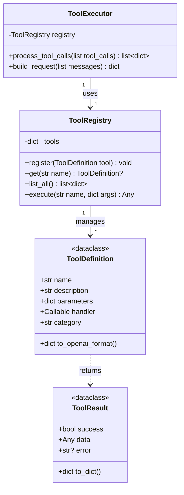
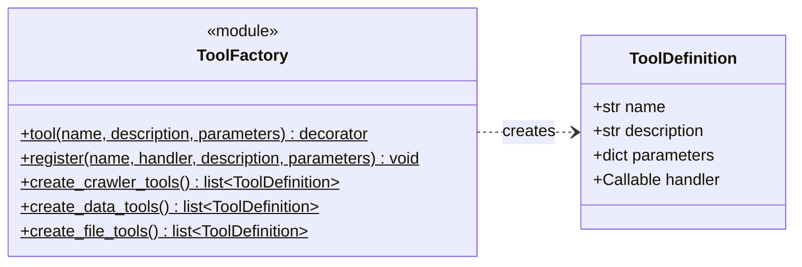
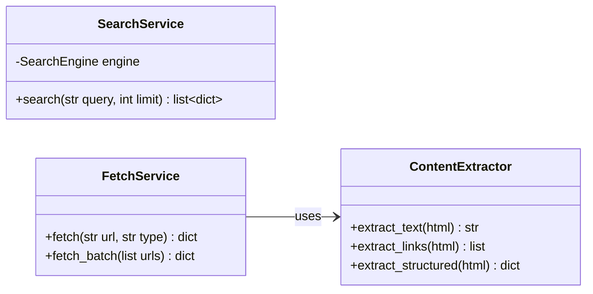

# 工具调用系统设计

## 概述

本文档描述 NanoClaw 工具调用系统的设计，采用简化的工厂模式，减少不必要的类层次。

---

## 一、核心类图



---

## 二、工具定义工厂

使用工厂函数创建工具，避免复杂的类继承：



---

## 三、核心类实现

### 3.1 ToolDefinition

```python
from dataclasses import dataclass, field
from typing import Callable, Any

@dataclass
class ToolDefinition:
    """工具定义"""
    name: str
    description: str
    parameters: dict  # JSON Schema
    handler: Callable[[dict], Any]
    category: str = "general"

    def to_openai_format(self) -> dict:
        return {
            "type": "function",
            "function": {
                "name": self.name,
                "description": self.description,
                "parameters": self.parameters
            }
        }
```

### 3.2 ToolResult

```python
from dataclasses import dataclass
from typing import Any, Optional

@dataclass
class ToolResult:
    """工具执行结果"""
    success: bool
    data: Any = None
    error: Optional[str] = None

    def to_dict(self) -> dict:
        return {
            "success": self.success,
            "data": self.data,
            "error": self.error
        }

    @classmethod
    def ok(cls, data: Any) -> "ToolResult":
        return cls(success=True, data=data)

    @classmethod
    def fail(cls, error: str) -> "ToolResult":
        return cls(success=False, error=error)
```

### 3.3 ToolRegistry

```python
from typing import Dict, List, Optional

class ToolRegistry:
    """工具注册表（单例）"""
    _instance = None

    def __new__(cls):
        if cls._instance is None:
            cls._instance = super().__new__(cls)
            cls._instance._tools: Dict[str, ToolDefinition] = {}
        return cls._instance

    def register(self, tool: ToolDefinition) -> None:
        self._tools[tool.name] = tool

    def get(self, name: str) -> Optional[ToolDefinition]:
        return self._tools.get(name)

    def list_all(self) -> List[dict]:
        return [t.to_openai_format() for t in self._tools.values()]

    def execute(self, name: str, arguments: dict) -> dict:
        tool = self.get(name)
        if not tool:
            return ToolResult.fail(f"Tool not found: {name}").to_dict()
        try:
            result = tool.handler(arguments)
            if isinstance(result, ToolResult):
                return result.to_dict()
            return ToolResult.ok(result).to_dict()
        except Exception as e:
            return ToolResult.fail(str(e)).to_dict()


# 全局注册表
registry = ToolRegistry()
```

### 3.4 ToolExecutor

```python
import json
from typing import List, Dict

class ToolExecutor:
    """工具执行器"""

    def __init__(self, registry: ToolRegistry = None):
        self.registry = registry or ToolRegistry()

    def process_tool_calls(self, tool_calls: List[dict]) -> List[dict]:
        """处理工具调用，返回消息列表"""
        results = []
        for call in tool_calls:
            name = call["function"]["name"]
            args = json.loads(call["function"]["arguments"])
            call_id = call["id"]

            result = self.registry.execute(name, args)

            results.append({
                "role": "tool",
                "tool_call_id": call_id,
                "name": name,
                "content": json.dumps(result, ensure_ascii=False)
            })
        return results

    def build_request(self, messages: List[dict], **kwargs) -> dict:
        """构建 API 请求"""
        return {
            "model": kwargs.get("model", "glm-5"),
            "messages": messages,
            "tools": self.registry.list_all(),
            "tool_choice": "auto"
        }
```

---

## 四、工具工厂模式

### 4.1 装饰器注册

```python
# backend/tools/factory.py

from .core import ToolDefinition, registry

def tool(name: str, description: str, parameters: dict, category: str = "general"):
    """工具注册装饰器"""
    def decorator(func):
        tool_def = ToolDefinition(
            name=name,
            description=description,
            parameters=parameters,
            handler=func,
            category=category
        )
        registry.register(tool_def)
        return func
    return decorator
```

### 4.2 使用示例

```python
# backend/tools/builtin/crawler.py

from ..factory import tool

# 网页搜索工具
@tool(
    name="web_search",
    description="搜索互联网获取信息",
    parameters={
        "type": "object",
        "properties": {
            "query": {"type": "string", "description": "搜索关键词"},
            "max_results": {"type": "integer", "default": 5}
        },
        "required": ["query"]
    },
    category="crawler"
)
def web_search(arguments: dict) -> dict:
    from ..services import SearchService
    query = arguments["query"]
    max_results = arguments.get("max_results", 5)
    service = SearchService()
    results = service.search(query, max_results)
    return {"results": results}


# 页面抓取工具
@tool(
    name="fetch_page",
    description="抓取指定网页内容",
    parameters={
        "type": "object",
        "properties": {
            "url": {"type": "string", "description": "网页URL"},
            "extract_type": {"type": "string", "enum": ["text", "links", "structured"]}
        },
        "required": ["url"]
    },
    category="crawler"
)
def fetch_page(arguments: dict) -> dict:
    from ..services import FetchService
    url = arguments["url"]
    extract_type = arguments.get("extract_type", "text")
    service = FetchService()
    result = service.fetch(url, extract_type)
    return result


# 计算器工具
@tool(
    name="calculator",
    description="执行数学计算",
    parameters={
        "type": "object",
        "properties": {
            "expression": {"type": "string", "description": "数学表达式"}
        },
        "required": ["expression"]
    },
    category="data"
)
def calculator(arguments: dict) -> dict:
    import ast
    import operator
    expr = arguments["expression"]
    # 安全计算
    ops = {
        ast.Add: operator.add,
        ast.Sub: operator.sub,
        ast.Mult: operator.mul,
        ast.Div: operator.truediv
    }
    node = ast.parse(expr, mode='eval')
    result = eval(compile(node, '<string>', 'eval'), {"__builtins__": {}}, ops)
    return {"result": result}
```

---

## 五、辅助服务类

工具依赖的服务保持独立，不与工具类耦合：



```python
# backend/tools/services.py

class SearchService:
    """搜索服务"""
    def __init__(self, engine=None):
        from ddgs import DDGS
        self.engine = engine or DDGS()

    def search(self, query: str, max_results: int = 5) -> list:
        results = list(self.engine.text(query, max_results=max_results))
        return [
            {"title": r["title"], "url": r["href"], "snippet": r["body"]}
            for r in results
        ]


class FetchService:
    """页面抓取服务"""
    def __init__(self, timeout: float = 30.0):
        self.timeout = timeout

    def fetch(self, url: str, extract_type: str = "text") -> dict:
        import httpx
        from bs4 import BeautifulSoup

        resp = httpx.get(url, timeout=self.timeout, follow_redirects=True)
        soup = BeautifulSoup(resp.text, "html.parser")

        extractor = ContentExtractor(soup)
        if extract_type == "text":
            return {"text": extractor.extract_text()}
        elif extract_type == "links":
            return {"links": extractor.extract_links()}
        else:
            return extractor.extract_structured()


class ContentExtractor:
    """内容提取器"""
    def __init__(self, soup):
        self.soup = soup

    def extract_text(self) -> str:
        # 移除脚本和样式
        for tag in self.soup(["script", "style"]):
            tag.decompose()
        return self.soup.get_text(separator="\n", strip=True)

    def extract_links(self) -> list:
        return [
            {"text": a.get_text(strip=True), "href": a.get("href")}
            for a in self.soup.find_all("a", href=True)
        ]

    def extract_structured(self) -> dict:
        return {
            "title": self.soup.title.string if self.soup.title else "",
            "text": self.extract_text(),
            "links": self.extract_links()[:20]
        }
```

---

## 六、工具初始化

```python
# backend/tools/__init__.py

from .core import ToolDefinition, ToolResult, ToolRegistry, registry, ToolExecutor
from .factory import tool

def init_tools():
    """初始化所有内置工具"""
    # 导入即自动注册
    from .builtin import crawler, data, weather

# 使用时
init_tools()
```

---

## 七、工具清单

| 类别      | 工具名称            | 描述   | 依赖服务          |
| ------- | --------------- | ---- | ------------- |
| crawler | `web_search`    | 网页搜索 | SearchService |
| crawler | `fetch_page`    | 单页抓取 | FetchService  |
| crawler | `crawl_batch`   | 批量爬取 | FetchService  |
| data    | `calculator`    | 数学计算 | CalculatorService |
| data    | `text_process`  | 文本处理 | -             |
| data    | `json_process`  | JSON处理 | -             |
| weather | `get_weather`   | 天气查询 | - (模拟数据)      |
| file    | `file_read`     | 读取文件 | -             |
| file    | `file_write`    | 写入文件 | -             |
| file    | `file_delete`   | 删除文件 | -             |
| file    | `file_list`     | 列出目录 | -             |
| file    | `file_exists`   | 检查存在 | -             |
| file    | `file_mkdir`    | 创建目录 | -             |

---

## 八、与旧设计对比

| 方面    | 旧设计               | 新设计       |
| ----- | ----------------- | --------- |
| 类数量   | 30+               | ~10       |
| 工具定义  | 继承 BaseTool       | 装饰器 + 函数  |
| 中间抽象层 | 5个（CrawlerTool 等） | 无         |
| 扩展方式  | 创建子类              | 写函数 + 装饰器 |
| 代码量   | 多                 | 少         |

---

## 九、总结

简化后的设计：

1. **核心类**：`ToolDefinition`、`ToolRegistry`、`ToolExecutor`、`ToolResult`
2. **工厂模式**：使用 `@tool` 装饰器注册工具
3. **服务分离**：工具依赖的服务独立，不与工具类耦合
4. **易于扩展**：新增工具只需写一个函数并加装饰器
